# BÁO CÁO THỰC TẬP FCAJ

### Thông tin sinh viên:
  **Họ và tên:** Nguyễn Bá Anh Khôi

  **Số điện thoại:** 0902094421

  **Email:** khoibadk2005@gmail.com

  **Trường:** Đại học Văn Lang - VLU

  **Ngành:** Công nghệ thông tin

  **Lớp:** AWS052026

  **Công ty thực tập:** Công ty TNHH Amazon Web Services Viet Nam

  **Vị trí thực tập:** Workforce Bootcamp - First Cloud AI Journey

  **Thời gian thực tập:** Từ ngày 04/05/2026 đến ngày 24/07/2026

<div style="display: flex; justify-content: center; width: 100%; margin: 20px 0;">
  
</div>

---

# PHẦN 1: NHẬT KÝ CÔNG VIỆC

Chương trình thực tập được thực hiện trong khoảng 3 tháng (12 tuần) tại First Cloud AI Journey (FCAJ), bắt đầu từ ngày 04/05/2026 đến 24/07/2026, với nội dung tổng quan các tuần như sau:

**Tuần 1:** [Làm quen với AWS và các dịch vụ cơ bản](1.1-Week1/)

**Tuần 2:** [Amazon S3, SQS và kiến trúc Event-Driven](1.2-Week2/)

**Tuần 3:** [AWS Lambda và xử lý ảnh bất đồng bộ](1.3-Week3/)

**Tuần 4:** [Amazon Rekognition và Textract - AI/ML phân tích hình ảnh](1.4-Week4/)

**Tuần 5:** [Amazon DynamoDB và lưu trữ kết quả phân tích](1.5-Week5/)

**Tuần 6:** [Amazon API Gateway và thiết kế RESTful API](1.6-Week6/)

**Tuần 7:** [Amazon Cognito và bảo mật truy cập](1.7-Week7/)

**Tuần 8:** [AWS Amplify và xây dựng giao diện Frontend](1.8-Week8/)

**Tuần 9:** [Phát triển backend - tích hợp Lambda, S3, SQS, AI/ML](1.9-Week9/)

**Tuần 10:** [Phát triển frontend - Dashboard giám sát hàng hóa](1.10-Week10/)

**Tuần 11:** [Kiểm thử toàn diện, viết blog và tham gia workshop](1.11-Week11/)

**Tuần 12:** [Hoàn thiện, bàn giao hệ thống và tổng kết thực tập](1.12-Week12/)

---

## Tuần 1: Làm quen với AWS và các dịch vụ cơ bản (04/05/2026 - 08/05/2026)

**Mục tiêu tuần 1:**

- Kết nối, làm quen với các thành viên và quy trình làm việc của First Cloud AI Journey (FCAJ).
- Hiểu tổng quan về AWS Cloud, các nhóm dịch vụ chính và cách sử dụng Console & CLI.
- Nắm được bối cảnh và mục tiêu dự án Giải pháp tự động hóa giám sát chất lượng hàng hóa.

**Các công việc cần triển khai trong tuần này:**

| Thứ | Công việc | Ngày bắt đầu | Ngày hoàn thành | Nguồn tài liệu |
|-----|-----------|--------------|-----------------|----------------|
| 2 | Làm quen với các thành viên và mentor trong FCAJ. Đọc và ghi nhớ nội quy, quy định của đơn vị thực tập. Tìm hiểu sơ bộ về mục tiêu dự án giám sát chất lượng hàng hóa Logistics. | 04/05/2026 | 04/05/2026 | |
| 3 | Tìm hiểu tổng quan về AWS Cloud Computing. Tìm hiểu các nhóm dịch vụ chính của AWS: Compute, Storage, Networking, Database, AI/ML. | 05/05/2026 | 05/05/2026 | https://aws.amazon.com/vi/what-is-aws/ |
| 4 | Tạo tài khoản AWS Free Tier. Tìm hiểu AWS Management Console và AWS CLI. Thực hành: Tạo tài khoản, cài đặt AWS CLI, cấu hình Access Key/Secret Key. | 06/05/2026 | 06/05/2026 | https://cloudjourney.awsstudygroup.com/vi/ |
| 5 | Tìm hiểu AWS Identity and Access Management (IAM): IAM User, IAM Role, IAM Policy, nguyên tắc Least Privilege. | 07/05/2026 | 07/05/2026 | https://docs.aws.amazon.com/IAM/ |
| 6 | Thực hành: Tạo IAM User và IAM Role cho Lambda. Gắn IAM Policy cơ bản (S3, SQS, Rekognition, Textract). Kiểm tra quyền qua AWS CLI. | 08/05/2026 | 08/05/2026 | https://cloudjourney.awsstudygroup.com/vi/ |

**Kết quả đạt được tuần 1:**

- Hiểu được AWS là gì và nắm được các nhóm dịch vụ chính: Compute, Storage, Networking, Database, AI/ML.
- Tạo và cấu hình thành công tài khoản AWS Free Tier.
- Cài đặt và cấu hình AWS CLI trên máy cá nhân.
- Hiểu khái niệm IAM User, Role, Policy và nguyên tắc phân quyền tối thiểu (Least Privilege).
- Nắm được bối cảnh và mục tiêu tổng thể của dự án giám sát chất lượng hàng hóa Logistics sẽ triển khai trong 3 tháng thực tập.

---

## Tuần 2: Amazon S3, SQS và kiến trúc Event-Driven (11/05/2026 - 15/05/2026)

**Mục tiêu tuần 2:**

- Hiểu sâu về Amazon S3 và cách tổ chức lưu trữ ảnh hàng hóa.
- Tìm hiểu Amazon SQS và vai trò làm buffer trong kiến trúc Event-Driven.
- Thiết kế luồng S3 → SQS → Lambda cho hệ thống xử lý ảnh bất đồng bộ.

**Các công việc cần triển khai trong tuần này:**

| Thứ | Công việc | Ngày bắt đầu | Ngày hoàn thành | Nguồn tài liệu |
|-----|-----------|--------------|-----------------|----------------|
| 2 | Tìm hiểu Amazon S3: Bucket, Object, Storage Class, Lifecycle Policy, Versioning. Nghiên cứu cách tổ chức prefix hợp lý cho bucket lưu ảnh hàng hóa hư hỏng. | 11/05/2026 | 11/05/2026 | https://docs.aws.amazon.com/s3/ |
| 3 | Tìm hiểu Amazon SQS: Standard Queue vs FIFO Queue. Hiểu các thông số: Visibility Timeout, Message Retention Period, Dead Letter Queue. | 12/05/2026 | 12/05/2026 | https://docs.aws.amazon.com/sqs/ |
| 4 | Nghiên cứu kiến trúc Event-Driven với mô hình S3 → SQS → Lambda. Hiểu lý do cần SQS làm buffer để tránh Lambda bị gọi ồ ạt khi nhiều ảnh upload cùng lúc. | 13/05/2026 | 13/05/2026 | https://cloudjourney.awsstudygroup.com/vi/ |
| 5 | Thực hành: Tạo S3 bucket lưu ảnh hàng hóa. Cấu hình S3 Lifecycle Policy và Versioning cho bucket. | 14/05/2026 | 14/05/2026 | https://000057.awsstudygroup.com/vi/ |
| 6 | Thực hành: Tạo SQS Standard Queue (image-processing-queue). Cấu hình Access Policy cho phép S3 gửi message vào SQS. Cấu hình S3 Event Notification. | 15/05/2026 | 15/05/2026 | https://cloudjourney.awsstudygroup.com/vi/ |

**Kết quả đạt được tuần 2:**

- Hiểu các khái niệm cốt lõi của Amazon S3: Bucket, Object, Storage Class, Lifecycle, Versioning.
- Nắm được vai trò của Amazon SQS trong kiến trúc Event-Driven và lý do cần buffer giữa S3 và Lambda.
- Tạo và cấu hình thành công S3 bucket với Event Notification.
- Tạo thành công SQS Standard Queue và cấp quyền cho S3 gửi message vào hàng đợi.
- Hiểu rõ luồng xử lý S3 → SQS → Lambda và lý do kiến trúc này phù hợp với bài toán xử lý ảnh quy mô lớn.

---

## Tuần 3: AWS Lambda và xử lý ảnh bất đồng bộ (18/05/2026 - 22/05/2026)

**Mục tiêu tuần 3:**

- Tìm hiểu AWS Lambda và cách viết hàm Python xử lý message từ SQS.
- Thực hành xây dựng Lambda function đọc thông tin ảnh từ SQS và S3.

**Các công việc cần triển khai trong tuần này:**

| Thứ | Công việc | Ngày bắt đầu | Ngày hoàn thành | Nguồn tài liệu |
|-----|-----------|--------------|-----------------|----------------|
| 2 | Tìm hiểu AWS Lambda: Function, Trigger, Runtime, Layer, Execution Role. Tìm hiểu mô hình tính phí. | 18/05/2026 | 18/05/2026 | https://docs.aws.amazon.com/lambda/ |
| 3 | Chuẩn bị IAM Role cho Lambda (Lambda-ImageProcessing-Role): AWSLambdaBasicExecutionRole, AmazonS3ReadOnlyAccess, AmazonSQSFullAccess, AmazonRekognitionFullAccess, AmazonTextractFullAccess. | 19/05/2026 | 19/05/2026 | https://docs.aws.amazon.com/IAM/ |
| 4 | Thực hành tạo Lambda Function (image-quality-processor, Python 3.x). Cấu hình Timeout = 60 giây, Memory = 512 MB. Gắn SQS làm Trigger với Batch size = 1. | 20/05/2026 | 20/05/2026 | https://cloudjourney.awsstudygroup.com/vi/ |
| 5 | Viết code Python xử lý SQS message: Parse SQS record lấy bucket name và object key từ S3 event. Ghi log ra CloudWatch. Deploy và kiểm thử. | 21/05/2026 | 21/05/2026 | https://docs.aws.amazon.com/lambda/ |
| 6 | Kiểm tra CloudWatch Logs sau khi upload ảnh. Debug lỗi kết nối. Dọn dẹp tài nguyên test sau kiểm thử. | 22/05/2026 | 22/05/2026 | |

**Kết quả đạt được tuần 3:**

- Hiểu cách hoạt động của AWS Lambda và mô hình tính phí.
- Tạo thành công IAM Role theo nguyên tắc Least Privilege cho Lambda.
- Tạo và cấu hình Lambda Function với SQS Trigger, Batch size = 1.
- Viết thành công code Python xử lý SQS message, đọc thông tin ảnh từ S3 và ghi log ra CloudWatch.
- Kiểm thử và debug thành công toàn bộ luồng S3 → SQS → Lambda.

---

## Tuần 4: Amazon Rekognition và Textract - AI/ML phân tích hình ảnh (25/05/2026 - 29/05/2026)

**Mục tiêu tuần 4:**

- Tích hợp Amazon Rekognition để nhận diện tình trạng hư hỏng của kiện hàng.
- Tích hợp Amazon Textract để trích xuất mã vận đơn và thông tin từ nhãn dán.

**Các công việc cần triển khai trong tuần này:**

| Thứ | Công việc | Ngày bắt đầu | Ngày hoàn thành | Nguồn tài liệu |
|-----|-----------|--------------|-----------------|----------------|
| 2 | Tìm hiểu Amazon Rekognition: detect_labels, detect_text, compare_faces. Hiểu cách sử dụng MaxLabels, MinConfidence để lọc kết quả phân tích. | 25/05/2026 | 25/05/2026 | https://docs.aws.amazon.com/rekognition/ |
| 3 | Tìm hiểu Amazon Textract: detect_document_text, analyze_document. Hiểu sự khác biệt giữa LINE và WORD block trong kết quả Textract. | 26/05/2026 | 26/05/2026 | https://docs.aws.amazon.com/textract/ |
| 4 | Tích hợp Amazon Rekognition vào Lambda function: Gọi detect_labels với ảnh từ S3, log nhãn nhận diện và confidence score. Thực hành với ảnh kiện hàng. | 27/05/2026 | 27/05/2026 | https://cloudjourney.awsstudygroup.com/vi/ |
| 5 | Tích hợp Amazon Textract vào Lambda function: Gọi detect_document_text với ảnh từ S3, trích xuất và log các dòng text (mã vận đơn, SĐT, địa chỉ). | 28/05/2026 | 28/05/2026 | https://cloudjourney.awsstudygroup.com/vi/ |
| 6 | Kiểm thử end-to-end: upload 5-10 ảnh cùng lúc lên S3. Kiểm tra CloudWatch Logs và SQS queue trống sau khi Lambda xử lý hết message. | 29/05/2026 | 29/05/2026 | |

**Kết quả đạt được tuần 4:**

- Hiểu cách sử dụng Amazon Rekognition để nhận diện tình trạng hàng hóa (Box, Cardboard, Damaged...).
- Hiểu cách sử dụng Amazon Textract để trích xuất văn bản từ nhãn dán vận đơn.
- Tích hợp thành công cả Rekognition và Textract vào Lambda function xử lý ảnh.
- Kiểm thử end-to-end thành công: ảnh upload → SQS → Lambda → AI phân tích → CloudWatch Logs.
- Hoàn thành kiểm thử song song với nhiều ảnh, xác nhận SQS queue được xử lý sạch.

---

## Tuần 5: Amazon DynamoDB và lưu trữ kết quả phân tích (01/06/2026 - 05/06/2026)

**Mục tiêu tuần 5:**

- Tìm hiểu Amazon DynamoDB để lưu trữ kết quả phân tích hình ảnh.
- Tích hợp Lambda lưu kết quả Rekognition, Textract vào DynamoDB.

**Các công việc cần triển khai trong tuần này:**

| Thứ | Công việc | Ngày bắt đầu | Ngày hoàn thành | Nguồn tài liệu |
|-----|-----------|--------------|-----------------|----------------|
| 2 | Tìm hiểu Amazon DynamoDB: Table, Item, Partition Key, Sort Key. Tìm hiểu mô hình tính phí: On-Demand vs Provisioned Capacity. | 01/06/2026 | 01/06/2026 | https://docs.aws.amazon.com/dynamodb/ |
| 3 | Thiết kế schema DynamoDB cho bảng image_scan_results: Partition Key: order_id, Sort Key: scan_timestamp, Attributes: bucket, key, rekognition_labels, textract_lines, status. | 02/06/2026 | 02/06/2026 | |
| 4 | Thực hành tạo DynamoDB table với On-Demand mode. Cập nhật IAM Role của Lambda thêm quyền AmazonDynamoDBFullAccess. | 03/06/2026 | 03/06/2026 | https://cloudjourney.awsstudygroup.com/vi/ |
| 5 | Tích hợp DynamoDB vào Lambda function: Sau khi gọi Rekognition và Textract, lưu kết quả vào bảng. Kiểm thử upload ảnh và xem item trong DynamoDB Console. | 04/06/2026 | 04/06/2026 | https://docs.aws.amazon.com/dynamodb/ |
| 6 | Tích hợp Amazon SNS gửi email cảnh báo khi phát hiện hàng hóa hư hỏng (confidence > 80%). Kiểm thử toàn bộ pipeline. | 05/06/2026 | 05/06/2026 | |

**Kết quả đạt được tuần 5:**

- Hiểu cách thiết kế schema DynamoDB hợp lý cho bài toán lưu kết quả phân tích ảnh.
- Tạo và cấu hình thành công DynamoDB table với On-Demand mode.
- Tích hợp thành công DynamoDB vào Lambda, kết quả phân tích được lưu trữ đầy đủ.
- Tích hợp Amazon SNS gửi email cảnh báo tự động khi phát hiện hàng hóa hư hỏng.
- Hoàn thành pipeline đầy đủ: S3 → SQS → Lambda → AI/ML → DynamoDB → SNS.

---

## Tuần 6: Amazon API Gateway và thiết kế RESTful API (08/06/2026 - 12/06/2026)

**Mục tiêu tuần 6:**

- Tìm hiểu Amazon API Gateway để xây dựng API cho frontend tra cứu kết quả phân tích.
- Thiết kế và kiểm thử các endpoint RESTful phục vụ dashboard quản lý.

**Các công việc cần triển khai trong tuần này:**

| Thứ | Công việc | Ngày bắt đầu | Ngày hoàn thành | Nguồn tài liệu |
|-----|-----------|--------------|-----------------|----------------|
| 2 | Tìm hiểu Amazon API Gateway: REST API và HTTP API. So sánh REST API và HTTP API để chọn phương án phù hợp cho dự án. | 08/06/2026 | 08/06/2026 | https://docs.aws.amazon.com/apigateway/ |
| 3 | Thiết kế các API endpoint cần thiết: GET /scans, GET /scans/{orderId}, POST /upload-url lấy presigned URL upload ảnh lên S3. | 09/06/2026 | 09/06/2026 | |
| 4 | Thực hành tạo API Gateway HTTP API. Tạo Lambda function trả về dữ liệu từ DynamoDB. Kết nối API Gateway với Lambda Integration. | 10/06/2026 | 10/06/2026 | https://cloudjourney.awsstudygroup.com/vi/ |
| 5 | Kiểm thử các API endpoint bằng Postman/curl. Xử lý CORS để cho phép frontend gọi API từ trình duyệt. | 11/06/2026 | 11/06/2026 | https://docs.aws.amazon.com/apigateway/ |
| 6 | Vẽ sơ đồ kiến trúc tổng thể của hệ thống giám sát hàng hóa (kiến trúc AWS Serverless). Trao đổi với mentor để rà soát kiến trúc đề xuất. | 12/06/2026 | 12/06/2026 | |

**Kết quả đạt được tuần 6:**

- Hiểu sự khác biệt giữa REST API và HTTP API trên Amazon API Gateway.
- Tạo thành công HTTP API với các endpoint phục vụ tra cứu kết quả phân tích.
- Kiểm thử thành công các API endpoint qua Postman, xử lý CORS đúng cách.
- Hoàn thành bản vẽ sơ đồ kiến trúc tổng thể AWS Serverless cho hệ thống, được mentor góp ý.

---

## Tuần 7: Amazon Cognito và bảo mật truy cập (15/06/2026 - 19/06/2026)

**Mục tiêu tuần 7:**

- Tìm hiểu Amazon Cognito và thiết kế phân quyền truy cập cho nhân viên Logistics.
- Tích hợp Cognito Authorizer vào API Gateway để bảo vệ API.

**Các công việc cần triển khai trong tuần này:**

| Thứ | Công việc | Ngày bắt đầu | Ngày hoàn thành | Nguồn tài liệu |
|-----|-----------|--------------|-----------------|----------------|
| 2 | Tìm hiểu Amazon Cognito User Pool và Identity Pool. So sánh các phương án xác thực: Cognito, IAM User, bên thứ ba. | 15/06/2026 | 15/06/2026 | https://docs.aws.amazon.com/cognito/ |
| 3 | Tìm hiểu cách kết hợp IAM Role với Cognito Identity Pool. Tìm hiểu Cognito Authorizer trên Amazon API Gateway và JWT Token. | 16/06/2026 | 16/06/2026 | https://docs.aws.amazon.com/cognito/ |
| 4 | Thực hành tạo Cognito User Pool cho hệ thống giám sát hàng hóa. Thực hành tạo App Client và cấu hình thuộc tính người dùng. | 17/06/2026 | 17/06/2026 | https://cloudjourney.awsstudygroup.com/vi/ |
| 5 | Thực hành tích hợp Cognito Authorizer vào API Gateway. Kiểm thử gọi API có yêu cầu xác thực bằng token Cognito. | 18/06/2026 | 18/06/2026 | https://docs.aws.amazon.com/cognito/ |
| 6 | Rà soát toàn bộ IAM Policy theo nguyên tắc Least Privilege. Đảm bảo mỗi Lambda function chỉ có đúng quyền cần thiết. | 19/06/2026 | 19/06/2026 | |

**Kết quả đạt được tuần 7:**

- Hiểu sự khác biệt giữa Cognito User Pool và Identity Pool và cách kết hợp với IAM Role.
- Tạo và cấu hình thành công Cognito User Pool cho hệ thống giám sát hàng hóa.
- Tích hợp thành công Cognito Authorizer vào API Gateway, đảm bảo chỉ người dùng đã xác thực mới gọi được API.
- Rà soát và tối ưu toàn bộ IAM Policy theo nguyên tắc Least Privilege.

---

## Tuần 8: AWS Amplify và xây dựng giao diện Frontend (22/06/2026 - 26/06/2026)

**Mục tiêu tuần 8:**

- Tìm hiểu AWS Amplify Hosting và bắt đầu xây dựng giao diện web cho hệ thống giám sát.
- Xây dựng trang đăng nhập và upload ảnh tích hợp với Cognito và S3.

**Các công việc cần triển khai trong tuần này:**

| Thứ | Công việc | Ngày bắt đầu | Ngày hoàn thành | Nguồn tài liệu |
|-----|-----------|--------------|-----------------|----------------|
| 2 | Tìm hiểu AWS Amplify Hosting: CI/CD pipeline, custom domain, build settings. So sánh Amplify Hosting với S3 Static Website Hosting. | 22/06/2026 | 22/06/2026 | https://docs.aws.amazon.com/amplify/ |
| 3 | Tìm hiểu Amplify UI Components cho React/Next.js: Authenticator component tích hợp Cognito, Storage component upload ảnh lên S3. | 23/06/2026 | 23/06/2026 | https://ui.docs.amplify.aws/ |
| 4 | Thực hành tạo ứng dụng web Next.js cơ bản. Tích hợp Amplify với Cognito User Pool. Xây dựng trang đăng nhập/đăng xuất. | 24/06/2026 | 24/06/2026 | https://cloudjourney.awsstudygroup.com/vi/ |
| 5 | Xây dựng trang upload ảnh: Gọi API lấy S3 presigned URL, upload ảnh trực tiếp lên S3 từ frontend, hiển thị trạng thái upload. | 25/06/2026 | 25/06/2026 | https://docs.amplify.aws/ |
| 6 | Kiểm thử toàn bộ luồng upload: Đăng nhập qua Cognito → Lấy presigned URL → Upload ảnh → SQS → Lambda xử lý. | 26/06/2026 | 26/06/2026 | |

**Kết quả đạt được tuần 8:**

- Hiểu AWS Amplify Hosting và CI/CD pipeline cho frontend web application.
- Xây dựng thành công ứng dụng Next.js với tích hợp Cognito (đăng nhập/đăng xuất).
- Triển khai thành công trang upload ảnh sử dụng S3 presigned URL.
- Kiểm thử thành công luồng đầy đủ từ giao diện người dùng đến AI phân tích.

---

## Tuần 9: Phát triển backend - tích hợp Lambda, S3, SQS, AI/ML (29/06/2026 - 03/07/2026)

**Mục tiêu tuần 9:**

- Hoàn thiện toàn bộ backend serverless với đầy đủ Lambda functions.
- Tối ưu hiệu năng xử lý và xử lý các trường hợp lỗi (error handling).

**Các công việc cần triển khai trong tuần này:**

| Thứ | Công việc | Ngày bắt đầu | Ngày hoàn thành | Nguồn tài liệu |
|-----|-----------|--------------|-----------------|----------------|
| 2 | Hoàn thiện orchestrator Lambda function: Xử lý đầy đủ các record từ SQS batch, gọi Rekognition và Textract song song, xử lý timeout và retry. | 29/06/2026 | 29/06/2026 | |
| 3 | Phát triển evaluator Lambda function: Đánh giá mức độ hư hỏng từ kết quả Rekognition, xác định ngưỡng confidence để phân loại. | 30/06/2026 | 30/06/2026 | |
| 4 | Phát triển processor Lambda function: Lưu đầy đủ kết quả vào DynamoDB, kích hoạt SNS notification với các ca nghiêm trọng. | 01/07/2026 | 01/07/2026 | |
| 5 | Cấu hình Dead Letter Queue (DLQ) cho SQS. Thêm CloudWatch Alarms cho Lambda errors và SQS queue depth. Kiểm thử các tình huống lỗi. | 02/07/2026 | 02/07/2026 | |
| 6 | Kiểm thử tải backend: upload 20-30 ảnh cùng lúc. Ghi nhận giới hạn và đề xuất phương án tối ưu. Viết tài liệu API cho frontend sử dụng. | 03/07/2026 | 03/07/2026 | |

**Kết quả đạt được tuần 9:**

- Hoàn thiện 3 Lambda functions (orchestrator, evaluator, processor) với error handling đầy đủ.
- Cấu hình DLQ để xử lý message thất bại, tránh mất dữ liệu.
- Thêm CloudWatch Alarms giám sát chủ động các lỗi hệ thống.
- Kiểm thử tải thành công với 20-30 ảnh đồng thời, backend ổn định.

---

## Tuần 10: Phát triển frontend - Dashboard giám sát hàng hóa (06/07/2026 - 10/07/2026)

**Mục tiêu tuần 10:**

- Hoàn thiện dashboard hiển thị kết quả phân tích hàng hóa theo thời gian thực.
- Xây dựng giao diện tra cứu lịch sử và xuất báo cáo.

**Các công việc cần triển khai trong tuần này:**

| Thứ | Công việc | Ngày bắt đầu | Ngày hoàn thành | Nguồn tài liệu |
|-----|-----------|--------------|-----------------|----------------|
| 2 | Xây dựng trang Dashboard tổng quan: Hiển thị số lượng ảnh đã xử lý hôm nay, biểu đồ tỷ lệ hàng hóa hư hỏng theo mức độ. | 06/07/2026 | 06/07/2026 | |
| 3 | Xây dựng trang tra cứu kết quả: Tìm kiếm theo mã vận đơn, xem chi tiết kết quả Rekognition và Textract. | 07/07/2026 | 07/07/2026 | |
| 4 | Xây dựng tính năng xuất báo cáo: Lọc theo ngày, mức độ hư hỏng, xuất danh sách ra CSV. Triển khai lên AWS Amplify. | 08/07/2026 | 08/07/2026 | |
| 5 | Kiểm thử toàn bộ frontend với các tình huống thực tế. Tối ưu responsive design cho mobile. | 09/07/2026 | 09/07/2026 | |
| 6 | Thu thập phản hồi từ mentor và các thành viên FCAJ về dashboard. Ghi nhận danh sách lỗi và đề xuất cải thiện. | 10/07/2026 | 10/07/2026 | |

**Kết quả đạt được tuần 10:**

- Dashboard hiển thị kết quả phân tích hàng hóa theo thời gian thực, kết nối ổn định với API Gateway.
- Hoàn thành trang tra cứu theo mã vận đơn, hiển thị đầy đủ kết quả Rekognition và Textract.
- Tính năng xuất báo cáo CSV hoạt động, hỗ trợ lọc linh hoạt.
- Triển khai thành công dashboard lên AWS Amplify, truy cập ổn định trên nhiều loại thiết bị.
- Thu thập được phản hồi thực tế từ mentor, làm cơ sở để hoàn thiện hệ thống ở tuần tiếp theo.

---

## Tuần 11: Kiểm thử toàn diện, viết blog và tham gia workshop (13/07/2026 - 17/07/2026)

**Mục tiêu tuần 11:**

- Kiểm thử toàn diện hệ thống về tải, bảo mật và độ ổn định.
- Viết blog chia sẻ kiến thức và tham gia workshop xử lý ảnh bất đồng bộ với S3, SQS, Lambda.

**Các công việc cần triển khai trong tuần này:**

| Thứ | Công việc | Ngày bắt đầu | Ngày hoàn thành | Nguồn tài liệu |
|-----|-----------|--------------|-----------------|----------------|
| 2 | Kiểm thử tải: upload nhiều ảnh đồng thời (30-50 ảnh). Ghi nhận giới hạn và đề xuất phương án mở rộng khi quy mô lớn hơn. | 13/07/2026 | 13/07/2026 | |
| 3 | Kiểm thử bảo mật: rà soát toàn bộ IAM Policy theo nguyên tắc Least Privilege. Rà soát Cognito và API Gateway. | 14/07/2026 | 14/07/2026 | |
| 4 | Viết bài blog chia sẻ kiến thức kỹ thuật về luồng xử lý ảnh S3→SQS→Lambda và đăng lên AWS Study Group. Xin góp ý từ mentor. | 15/07/2026 | 15/07/2026 | http://awsstudygroup.com |
| 5 | Tham gia Workshop: Xây dựng luồng xử lý hình ảnh bất đồng bộ sử dụng Amazon S3, SQS và AWS Lambda. Thực hành đầy đủ 6 bước. | 16/07/2026 | 16/07/2026 | https://cloudjourney.awsstudygroup.com/vi/ |
| 6 | Tổng hợp toàn bộ kết quả kiểm thử (tải, bảo mật, chi phí). Lập danh sách lỗi và hạn chế cần khắc phục trước khi bàn giao. | 17/07/2026 | 17/07/2026 | |

**Kết quả đạt được tuần 11:**

- Hoàn thành kiểm thử tải, xác định được ngưỡng hoạt động ổn định của hệ thống.
- Hoàn thành rà soát bảo mật, đảm bảo các IAM Policy và Cognito tuân thủ nguyên tắc Least Privilege.
- Viết và đăng thành công bài blog kỹ thuật lên AWS Study Group, nhận được phản hồi tích cực.
- Hoàn thành workshop xử lý ảnh bất đồng bộ S3→SQS→Lambda, củng cố kiến thức thực hành toàn bộ kiến trúc của dự án.
- Lập được danh sách đầy đủ các lỗi và hạn chế cần khắc phục, chuẩn bị cho giai đoạn hoàn thiện.

---

## Tuần 12: Hoàn thiện, bàn giao hệ thống và tổng kết thực tập (20/07/2026 - 24/07/2026)

**Mục tiêu tuần 12:**

- Khắc phục toàn bộ lỗi còn tồn đọng, đưa hệ thống vào vận hành chính thức.
- Hoàn thiện báo cáo thực tập và tổng kết toàn bộ quá trình thực tập tại FCAJ.

**Các công việc cần triển khai trong tuần này:**

| Thứ | Công việc | Ngày bắt đầu | Ngày hoàn thành | Nguồn tài liệu |
|-----|-----------|--------------|-----------------|----------------|
| 2 | Khắc phục các lỗi đã ghi nhận ở tuần 11 (giao diện, hiệu năng, bảo mật). Kiểm thử lại toàn bộ hệ thống sau khi sửa lỗi. | 20/07/2026 | 20/07/2026 | |
| 3 | Viết tài liệu hướng dẫn sử dụng dashboard cho nhân viên kho. Viết tài liệu vận hành và xử lý sự cố cơ bản (runbook). | 21/07/2026 | 21/07/2026 | |
| 4 | Bàn giao hệ thống Giám sát Chất lượng Hàng hóa cho bộ phận Logistics. Hướng dẫn trực tiếp cách vận hành, theo dõi và bổ sung tính năng mới. | 22/07/2026 | 22/07/2026 | |
| 5 | Hoàn thiện toàn bộ nội dung Báo cáo thực tập: Bản đề xuất, Workshop, Tự đánh giá. Rà soát lại số liệu chi phí, kiến trúc và kết quả đạt được. | 23/07/2026 | 23/07/2026 | |
| 6 | Tổng kết toàn bộ quá trình thực tập 3 tháng tại FCAJ. Hoàn thiện Phần 7: Chia sẻ, đóng góp ý kiến với chương trình FCAJ. | 24/07/2026 | 24/07/2026 | |

**Kết quả đạt được tuần 12:**

- Hệ thống hoạt động ổn định sau khi khắc phục toàn bộ lỗi tồn đọng, sẵn sàng vận hành chính thức.
- Hoàn thành tài liệu hướng dẫn sử dụng và vận hành, giúp bộ phận Logistics tự quản lý hệ thống.
- Bàn giao thành công hệ thống Giám sát Chất lượng Hàng hóa, được đội ngũ đánh giá đáp ứng đúng nhu cầu.
- Hoàn thiện toàn bộ Báo cáo thực tập với đầy đủ các phần.
- Tổng kết được những kiến thức, kỹ năng đã học và những trải nghiệm đáng nhớ trong 3 tháng thực tập tại First Cloud AI Journey.

---

# PHẦN 2: BẢN ĐỀ XUẤT

## GIẢI PHÁP TỰ ĐỘNG HÓA GIÁM SÁT CHẤT LƯỢNG HÀNG HÓA DỰA TRÊN SERVERLESS VÀ AI/ML

#### Tóm tắt điều hành

Trong lĩnh vực Logistics, doanh nghiệp đang chịu áp lực lớn về thời gian xử lý, độ chính xác dữ liệu và khả năng kiểm soát tổn thất hàng hóa. Việc giám sát chất lượng hàng hóa tại kho hiện nay phần lớn vẫn phụ thuộc vào con người, dẫn đến tình trạng xử lý sự cố chậm, dữ liệu bị phân tán và khó cập nhật theo thời gian thực.

Nhóm đề xuất xây dựng hệ thống **"Giải pháp tự động hóa giám sát chất lượng hàng hóa dựa trên kiến trúc Serverless và Trí tuệ nhân tạo (AI/ML)"**. Đây là một hệ thống phần mềm ứng dụng các dịch vụ của Amazon Web Services (AWS), cho phép nhân viên giao hàng hoặc khách hàng chụp ảnh kiện hàng gặp sự cố như rách, vỡ, móp méo hoặc hư hỏng, sau đó tải trực tiếp hình ảnh lên hệ thống để được phân tích tự động.

Hệ thống sử dụng AI/ML để nhận diện mức độ hư hại của hàng hóa, trích xuất thông tin vận đơn, lưu trữ bằng chứng và gửi cảnh báo cho bộ phận liên quan. Nhờ đó, quy trình xử lý sự cố có thể được rút ngắn từ vài giờ hoặc vài ngày xuống còn vài giây, đồng thời giúp doanh nghiệp giảm chi phí vận hành, hạn chế sai sót thủ công và nâng cao chất lượng dịch vụ.

---

#### Tuyên bố vấn đề

##### Vấn đề hiện tại

Theo khảo sát thực tế, việc ghi nhận và xử lý hàng hóa hư hỏng hiện nay đang gặp nhiều điểm lỗi trong quy trình vận hành:

- **Quy trình thủ công, tốn thời gian và dễ sai sót:** Khi phát hiện hàng hóa bị hư hỏng, nhân viên thường phải tự chụp ảnh bằng điện thoại cá nhân, gửi qua nhóm chat hoặc lập tờ trình giấy. Bộ phận thẩm định sau đó phải tổng hợp các thông tin rời rạc này để nhập lại vào hệ thống ERP và xử lý thủ tục bồi hoàn cho khách hàng. Quy trình này mất nhiều thời gian và dễ gây nhầm lẫn dữ liệu.

- **Thiếu khả năng tự động hóa và cảnh báo tức thời:** Do chưa có phần mềm tự động phân tích hình ảnh và đọc thông tin đơn hàng, quản lý kho thường không biết ngay mức độ hư hỏng của hàng hóa để đưa ra quyết định xử lý kịp thời. Việc phản hồi chậm làm ảnh hưởng đến trải nghiệm khách hàng và uy tín dịch vụ.

- **Thiếu khả năng mở rộng hệ thống:** Vào mùa cao điểm, số lượng hàng hóa đổ về kho tăng mạnh. Quy trình kiểm tra thủ công không thể xử lý song song nhiều đơn hàng cùng lúc, dẫn đến quá tải, bỏ sót hàng hóa hư hỏng hoặc để sản phẩm lỗi tiếp tục đi đến tay người tiêu dùng.

- **Dữ liệu lưu trữ phân mảnh, khó truy xuất:** Hồ sơ sự cố hiện có thể nằm rải rác trong sổ tay, file Excel hoặc các nhóm chat. Khi cần thống kê tỷ lệ tổn thất theo tháng/quý để báo cáo cho ban giám đốc, nhân viên phải rà soát thủ công, mất thời gian và dễ sai lệch.

- **Chi phí vận hành cao:** Doanh nghiệp phải duy trì nhân sự chuyên trách tại từng điểm kho để kiểm tra, nhập liệu và xử lý sự cố. Bên cạnh chi phí nhân công, các sai sót thông tin và tranh chấp đền bù kéo dài cũng làm suy giảm lợi nhuận và uy tín của doanh nghiệp Logistics.

---

#### Giải pháp đề xuất

Nhóm đề xuất xây dựng hệ thống tự động hóa quy trình giám sát chất lượng hàng hóa dựa trên kiến trúc Serverless và AI/ML. Hệ thống tập trung vào các khả năng cốt lõi sau:

- **Tự động hóa bằng AI thông minh:** Hệ thống sử dụng Amazon Rekognition để phân tích hình ảnh hàng hóa và nhận diện dấu hiệu hư hỏng. Kết quả phân tích có thể bao gồm nhãn trạng thái, mức độ hư hại và điểm tin cậy. Amazon Textract được dùng để trích xuất mã vận đơn, địa chỉ hoặc các thông tin văn bản liên quan từ ảnh mà không cần nhập tay.

- **Xử lý bất đồng bộ theo thời gian thực:** Hình ảnh sau khi được tải lên Amazon S3 sẽ kích hoạt luồng xử lý tự động. Dữ liệu hình ảnh, mã vận đơn và kết quả phân tích được đồng bộ về Amazon DynamoDB để tra cứu, thống kê và xuất báo cáo. Cách xử lý này giúp rút ngắn thời gian ghi nhận và phản hồi từ vài ngày xuống còn vài giây.

- **Hạ tầng Serverless tự động co giãn:** Hệ thống chạy trên các dịch vụ Serverless của AWS, có thể tự động mở rộng khi số lượng ảnh tăng đột biến vào mùa cao điểm. Doanh nghiệp không cần quản lý máy chủ thủ công nhưng vẫn đảm bảo khả năng xử lý nhiều yêu cầu cùng lúc.

- **Quản lý tập trung và minh bạch dữ liệu:** Tất cả lịch sử quét, hình ảnh bằng chứng, mã vận đơn và trạng thái xử lý được lưu trữ tập trung. Người quản lý có thể tra cứu lịch sử bất kỳ lúc nào, kiểm tra bằng chứng và xuất báo cáo thống kê tình hình hàng hóa hư hỏng.

- **Tối ưu hóa chi phí vận hành:** Việc đưa AI vào quy trình giúp giảm sai sót so với nhập liệu thủ công, giảm nhu cầu nhân sự chuyên trách tại từng kho, rút ngắn thời gian giải quyết tranh chấp và nâng cao độ tin cậy trong xử lý bồi hoàn.

---

#### Kiến trúc giải pháp

##### Kiến trúc tổng quan
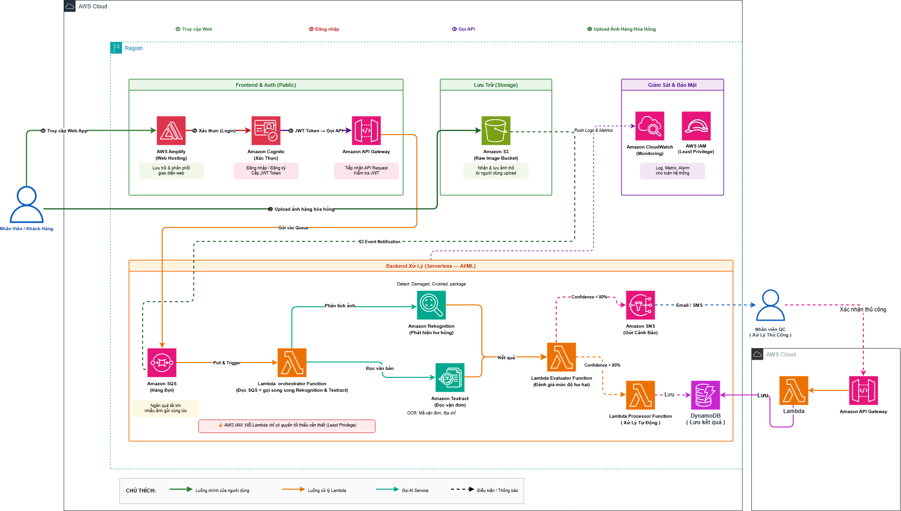

Hệ thống được thiết kế theo mô hình kiến trúc hướng sự kiện, sử dụng các dịch vụ AWS để tự động co giãn theo lưu lượng thực tế. Toàn bộ vòng đời của một yêu cầu giám sát chất lượng hàng hóa được chia thành 4 lớp công nghệ chính:

| Lớp kiến trúc | Vai trò | Dịch vụ AWS đề xuất |
| --- | --- | --- |
| Frontend & Auth | Cung cấp giao diện web, quản lý đăng nhập/đăng ký, cấp JWT Token và kiểm soát quyền truy cập API | AWS Amplify, Amazon Cognito, Amazon API Gateway |
| Storage | Tiếp nhận và lưu trữ ảnh hàng hóa hư hỏng do người dùng tải lên | Amazon S3 |
| Backend & AI/ML | Xử lý sự kiện tải ảnh, phân tích hình ảnh, trích xuất thông tin vận đơn, đánh giá mức độ hư hại và cập nhật dữ liệu | Amazon SQS, AWS Lambda, Amazon Rekognition, Amazon Textract, Amazon DynamoDB |
| Giám sát & Bảo mật | Theo dõi hoạt động hệ thống, quản lý log, phân quyền truy cập theo nguyên tắc least privilege | Amazon CloudWatch, AWS IAM |

##### Luồng xử lý chính

| Bước | Mô tả |
| --- | --- |
| 1 | Người dùng đăng nhập vào hệ thống thông qua giao diện web được triển khai bằng AWS Amplify và xác thực bằng Amazon Cognito. |
| 2 | Người dùng tải ảnh kiện hàng bị hư hỏng lên hệ thống. Ảnh được lưu vào Amazon S3 Raw Image Bucket. |
| 3 | S3 Event Notification phát sinh sự kiện sau khi ảnh được tải lên thành công và đưa thông tin xử lý vào Amazon SQS. |
| 4 | Lambda orchestrator-function đọc sự kiện từ SQS, sau đó gọi Amazon Rekognition để phát hiện hư hỏng và Amazon Textract để đọc mã vận đơn/thông tin văn bản. |
| 5 | Lambda evaluator-function đánh giá mức độ hư hại dựa trên kết quả AI/ML và xác định trạng thái xử lý. |
| 6 | Lambda processor-function lưu kết quả vào Amazon DynamoDB, cập nhật trạng thái hồ sơ và kích hoạt cảnh báo nếu cần. |
| 7 | Amazon SNS gửi thông báo Email/SMS cho quản lý kho hoặc bộ phận xử lý khi phát hiện sự cố nghiêm trọng. |
| 8 | Amazon CloudWatch ghi nhận log, metrics và hỗ trợ theo dõi lỗi trong toàn bộ quá trình vận hành. |

---

#### Các dịch vụ AWS sử dụng

##### Frontend & Auth

- **AWS Amplify:** Lưu trữ và phân phối giao diện web cho người dùng.
- **Amazon Cognito:** Quản lý đăng nhập, đăng ký và cấp JWT Token.
- **Amazon API Gateway:** Tiếp nhận API request, kiểm tra token và chuyển tiếp yêu cầu đến backend.

##### Storage

- **Amazon S3:** Lưu trữ ảnh gốc của hàng hóa, đóng vai trò điểm tiếp nhận dữ liệu đầu vào.

##### Backend Serverless & AI/ML

- **Amazon SQS:** Làm hàng đợi trung gian, giúp hệ thống xử lý bất đồng bộ và tránh quá tải khi nhiều ảnh được tải lên cùng lúc.
- **AWS Lambda orchestrator-function:** Đọc sự kiện từ SQS và điều phối các tác vụ phân tích AI/ML.
- **Amazon Rekognition:** Phân tích hình ảnh để phát hiện dấu hiệu hư hỏng của kiện hàng.
- **Amazon Textract:** Trích xuất văn bản, mã vận đơn hoặc thông tin giao hàng từ ảnh.
- **AWS Lambda evaluator-function:** Đánh giá mức độ hư hại và phân loại trạng thái xử lý.
- **AWS Lambda processor-function:** Lưu kết quả, cập nhật hồ sơ và kích hoạt các bước xử lý tiếp theo.
- **Amazon DynamoDB:** Lưu trữ kết quả phân tích, lịch sử xử lý, trạng thái đơn hàng và dữ liệu phục vụ báo cáo.
- **Amazon SNS:** Gửi cảnh báo Email/SMS cho bộ phận liên quan.

##### Giám sát & Bảo mật

- **Amazon CloudWatch:** Theo dõi log, metrics, cảnh báo lỗi và hiệu năng của hệ thống.
- **AWS IAM:** Quản lý quyền truy cập theo nguyên tắc least privilege, đảm bảo từng dịch vụ chỉ có quyền cần thiết để hoạt động.

---

#### Đánh giá rủi ro

| Rủi ro | Ảnh hưởng | Hướng xử lý |
| --- | --- | --- |
| Chất lượng ảnh đầu vào kém | AI có thể nhận diện sai hoặc không trích xuất được mã vận đơn | Hướng dẫn người dùng chụp ảnh rõ nét, đủ sáng; kiểm tra định dạng và kích thước ảnh trước khi tải lên |
| Kết quả AI/ML chưa chính xác trong một số trường hợp | Có thể phân loại sai mức độ hư hỏng | Cho phép người quản lý xác nhận thủ công với các trường hợp có điểm tin cậy thấp |
| Lưu lượng tăng cao vào mùa cao điểm | Hệ thống có thể phát sinh độ trễ nếu không kiểm soát hàng đợi tốt | Sử dụng SQS để điều tiết tải, Lambda tự động co giãn và CloudWatch để giám sát backlog |
| Rò rỉ dữ liệu hình ảnh hoặc thông tin vận đơn | Ảnh hưởng đến bảo mật dữ liệu khách hàng | Áp dụng Cognito, IAM least privilege, phân quyền truy cập S3 và mã hóa dữ liệu khi lưu trữ |
| Chi phí tăng nếu xử lý số lượng ảnh quá lớn | Ảnh hưởng đến ngân sách vận hành | Theo dõi usage bằng CloudWatch, đặt cảnh báo chi phí và tối ưu kích thước ảnh trước khi phân tích |

---

#### Kết quả kỳ vọng

- Rút ngắn thời gian ghi nhận và xử lý sự cố hàng hóa từ vài giờ hoặc vài ngày xuống còn vài giây.
- Tự động nhận diện dấu hiệu hư hỏng của hàng hóa bằng AI, giảm phụ thuộc vào kiểm tra thủ công.
- Tự động trích xuất mã vận đơn và thông tin liên quan, hạn chế lỗi nhập liệu.
- Tập trung hóa dữ liệu sự cố, hình ảnh bằng chứng và trạng thái xử lý trên một hệ thống duy nhất.
- Hỗ trợ quản lý kho tra cứu lịch sử, thống kê tỷ lệ tổn thất và xuất báo cáo nhanh chóng.
- Tăng khả năng mở rộng trong mùa cao điểm nhờ kiến trúc Serverless.
- Giảm chi phí nhân sự vận hành, giảm tranh chấp đền bù và nâng cao uy tín dịch vụ Logistics.

---

#### Kết luận

Giải pháp tự động hóa giám sát chất lượng hàng hóa dựa trên Serverless và AI/ML giúp doanh nghiệp Logistics chuyển đổi quy trình xử lý sự cố từ thủ công sang tự động, tập trung và có khả năng mở rộng. Việc kết hợp Amazon S3, SQS, Lambda, Rekognition, Textract, DynamoDB, SNS, CloudWatch và IAM tạo ra một kiến trúc phù hợp cho bài toán xử lý hình ảnh theo thời gian thực, đồng thời tối ưu chi phí vận hành và cải thiện chất lượng dịch vụ khách hàng.

---

## Ước tính chi phí vận hành hệ thống trên AWS

#### Tóm tắt điều hành

Tài liệu này ước tính chi phí AWS cho hệ thống phát hiện và xử lý hàng hóa hư hỏng trong kho vận, dựa trên kiến trúc serverless sử dụng Amplify, Cognito, API Gateway, S3, SQS, Lambda, Rekognition, Textract, DynamoDB, SNS, CloudWatch và IAM.

Ước tính được xây dựng cho kịch bản thử nghiệm / vận hành thực tế trong 1 tuần, với khối lượng khoảng 245 ảnh/tuần và ~30 người dùng hoạt động. Trong phạm vi giả định này, tổng chi phí thực tế của tài khoản AWS mới vẫn là $0,00 do toàn bộ mức sử dụng nằm trong Free Tier tương ứng. Nếu tính theo đơn giá chuẩn mà không áp Free Tier, tổng chi phí 1 tuần vào khoảng $1,57 USD.

---

#### 1. Tổng quan kiến trúc hệ thống

Hệ thống serverless trên AWS dùng để phát hiện và xử lý hàng hóa hư hỏng trong kho vận. Người dùng truy cập giao diện web được lưu trữ trên AWS Amplify, đăng nhập qua Amazon Cognito để nhận JWT token, sau đó gọi API qua Amazon API Gateway để tải ảnh hàng hóa lên Amazon S3.

Khi ảnh được tải lên, S3 phát sự kiện đẩy vào Amazon SQS để tránh quá tải khi nhiều ảnh được gửi cùng lúc. SQS kích hoạt chuỗi AWS Lambda gồm xử lý ảnh, gọi Amazon Rekognition để phát hiện hư hỏng, gọi Amazon Textract để đọc mã vận đơn hoặc địa chỉ trên nhãn hàng, sau đó ghi kết quả vào Amazon DynamoDB và gửi cảnh báo qua Amazon SNS khi độ tin cậy của AI dưới 80%.

Toàn bộ hệ thống được giám sát bởi Amazon CloudWatch và áp dụng nguyên tắc least-privilege qua AWS IAM cho từng hàm Lambda. Báo cáo này ước tính chi phí AWS cho 12 dịch vụ xuất hiện trong bản vẽ, cho một tuần sử dụng.

---

#### 2. Giả định sử dụng làm cơ sở ước tính

Các giả định dưới đây được dùng làm cơ sở tính toán:

- Khối lượng ảnh xử lý: khoảng 35 ảnh/ngày x 7 ngày, tương đương 245 ảnh/tuần.
- Người dùng hoạt động: khoảng 30 nhân viên/khách hàng đăng nhập và sử dụng web app trong tuần.
- Tài khoản AWS: tài khoản mới, còn trong 12 tháng AWS Free Tier.
- Vùng giá tham khảo: US East (N. Virginia).

---

#### 3. Bảng ước tính chi phí theo từng dịch vụ AWS (1 tuần)

| Dịch vụ AWS | Khối lượng sử dụng ước tính (1 tuần) | Đơn giá tham khảo (US East, N. Virginia) | Chi phí theo đơn giá chuẩn (chưa áp Free Tier) | Hạn mức AWS Free Tier áp dụng | Chi phí thực tế ước tính (tài khoản mới, đã áp Free Tier) |
| --- | --- | --- | --- | --- | --- |
| AWS Amplify (Hosting giao diện web) | ~5 lần build, ~0,5 GB lưu trên CDN, ~0,5 GB dữ liệu truyền cho ~30 người dùng | $0,01/phút build, $0,023/GB-tháng, $0,15/GB truyền dữ liệu | ≈ $0,23 | 1.000 phút build + 5 GB lưu trữ + 15 GB truyền dữ liệu/tháng (12 tháng đầu) | $0,00 |
| Amazon Cognito (Xác thực đăng nhập) | ~30 người dùng hoạt động (MAU) | $0,015/MAU | ≈ $0,45 | 10.000 MAU/tháng | $0,00 |
| Amazon API Gateway (REST API) | ~1.800 lượt gọi API | $3,50/1 triệu lượt gọi | ≈ $0,006 | 1.000.000 lượt gọi/tháng (12 tháng đầu) | $0,00 |
| Amazon S3 (Raw Image Bucket) | 245 lượt PUT + 245 lượt GET, ~0,5 GB lưu trữ | $0,005/1.000 PUT, $0,0004/1.000 GET, $0,023/GB-tháng | ≈ $0,004 | 2.000 PUT + 20.000 GET + 5 GB lưu trữ/tháng | $0,00 |
| Amazon SQS (Hàng đợi xử lý) | ~735 request | $0,40/1 triệu request | ≈ $0,0003 | 1.000.000 request/tháng | $0,00 |
| AWS Lambda (3 hàm) | ~800 lượt gọi, ~800 GB-giây | $0,20/1 triệu lượt gọi + $0,0000166667/GB-giây | ≈ $0,013 | 1.000.000 lượt gọi + 400.000 GB-giây/tháng | $0,00 |
| Amazon Rekognition (Phát hiện hư hỏng) | 245 ảnh xử lý | $0,001/ảnh | ≈ $0,245 | 5.000 ảnh/tháng (12 tháng đầu) | $0,00 |
| Amazon Textract (Đọc vận đơn) | 245 trang | $0,0015/trang | ≈ $0,368 | 1.000 trang/tháng (3 tháng đầu) | $0,00 |
| Amazon DynamoDB (Lưu log & lịch sử) | 245 lượt ghi + 300 lượt đọc | $0,625/1 triệu WRU, $0,125/1 triệu RRU | ≈ $0,0002 | 25 WCU/RCU + 25 GB lưu trữ/tháng | $0,00 |
| Amazon SNS (Gửi cảnh báo Email/SMS) | ~25 email cảnh báo | $2,00/100.000 email đã gửi | ≈ $0,0005 | 1.000 email/tháng (12 tháng đầu) | $0,00 |
| Amazon CloudWatch (Log, Metric, Alarm) | ~30 MB log, 3-5 metric, 3-5 alarm | $0,50/GB log, $0,30/metric-tháng, $0,10/alarm-tháng | ≈ $0,10 – $0,40 | 5 GB log + 10 metric + 10 alarm/tháng | $0,00 |
| AWS IAM (Phân quyền least-privilege) | Không tính phí theo lượt sử dụng | Miễn phí | $0,00 | Luôn miễn phí | $0,00 |

---

#### 4. Tổng hợp chi phí

**Tổng theo đơn giá chuẩn (chưa áp Free Tier):** khoảng  $1,57 USD

Tổng chi phí thực tế ước tính (tài khoản mới, đã áp Free Tier): **$0,00 USD**

Hai dòng trên phản ánh hai góc nhìn:

- Chi phí theo đơn giá chuẩn nếu không có Free Tier.
- Chi phí thực tế sẽ xuất hiện trên hóa đơn AWS trong tuần thử nghiệm, bằng $0,00 vì toàn bộ khối lượng sử dụng nằm trong hạn mức Free Tier.

---

#### 5. Dự báo khi mở rộng quy mô hoặc hết hạn Free Tier

Nếu hệ thống vận hành liên tục trong một tháng đầy đủ, phần lớn dịch vụ vẫn nằm trong hạn mức Free Tier hàng tháng. Điểm cần lưu ý nhất là Amazon Textract vì hạn mức miễn phí chỉ kéo dài 3 tháng đầu. Tuy nhiên, ở quy mô hiện tại, tổng chi phí AWS hàng tháng dự kiến vẫn rất thấp, ngay cả khi không còn Free Tier.

---

#### 6. Hạn chế của ước tính và khuyến nghị

- Đây là ước tính dựa trên giả định lưu lượng, không phải số liệu billing thực tế.
- Số liệu chính xác nhất là theo dõi trực tiếp trong AWS Cost Explorer sau khi hệ thống chạy thật.
- Giá tham khảo theo vùng US East (N. Virginia); giá tại vùng khác có thể chênh lệch.
- Chưa bao gồm các chi phí ngoài phạm vi bản vẽ như Support Plan, domain, Route 53, WAF hoặc chi phí nhân sự vận hành.

---

#### 7. Nguồn tham khảo

- AWS Lambda Pricing: https://aws.amazon.com/lambda/pricing/
- Amazon API Gateway Pricing: https://aws.amazon.com/api-gateway/pricing/
- Amazon S3 Pricing: https://aws.amazon.com/s3/pricing/
- Amazon SQS Pricing: https://aws.amazon.com/sqs/pricing/
- Amazon Rekognition Pricing: https://aws.amazon.com/rekognition/pricing/
- Amazon Textract Pricing: https://aws.amazon.com/textract/pricing/
- Amazon DynamoDB Pricing: https://aws.amazon.com/dynamodb/pricing/on-demand
- Amazon SNS Pricing: https://aws.amazon.com/sns/pricing/
- Amazon Cognito Pricing: https://aws.amazon.com/cognito/pricing/
- Amazon CloudWatch Pricing: https://aws.amazon.com/cloudwatch/pricing/
- AWS Amplify Pricing: https://aws.amazon.com/amplify/pricing/
- AWS Free Tier: https://aws.amazon.com/free/

---

# PHẦN 3: CÁC BÀI BLOGS ĐÃ ĐĂNG

Phần này giới thiệu các bài blog kỹ thuật mà tôi và nhóm đã nghiên cứu, biên soạn và chia sẻ trên cộng đồng AWS Study Group.

<div style="text-align: left;">

#### Danh sách bài blog

1. [Blog 1 — Samsung xử lý bài toán "giá bị lệch" nhờ AWS Lambda Response Streaming](3.1-Blog1/)  
   Bài blog giải thích cách Samsung ứng dụng AWS Lambda Response Streaming để khắc phục triệt để bài toán độ trễ trong hệ thống thương mại điện tử toàn cầu. Bằng cách loại bỏ các lớp cache trung gian và truy vấn trực tiếp Pricing Engine theo thời gian thực, Samsung đã giảm 98% độ trễ P90 (từ 4.500 ms xuống còn 50 ms) và tối ưu hóa hạ tầng từ hơn 100 máy chủ xuống chỉ còn 5–10 hàm Lambda.

2. [Blog 2 — S3 Intelligent-Tiering: Khi lưu trữ dữ liệu tự "biết" nên nằm ở tầng nào](3.2-Blog2/)  
   Bài blog giới thiệu Amazon S3 Intelligent-Tiering, lớp lưu trữ (storage class) tự động theo dõi tần suất truy cập của từng object và luân chuyển dữ liệu vào đúng tầng lưu trữ phù hợp mà không cần can thiệp thủ công hay tốn phí giám sát. Cơ chế này bao gồm 3 tầng truy cập tự động (Frequent Access, Infrequent Access, Archive Instant Access) cùng 2 tầng lưu trữ sâu tùy chọn, mang lại giải pháp tối ưu chi phí hiệu quả cho các data lake có mô hình truy cập khó dự đoán.

3. [Blog 3 — Đảm bảo công bằng trong game: Phát hiện và ngăn chặn gian lận qua ảnh đại diện với Amazon Textract](3.3-Blog3/)  
   Bài blog trình bày giải pháp kiến trúc Serverless sử dụng Amazon Textract để tự động phát hiện và xử lý văn bản nhúng trái phép trên ảnh đại diện game. Khi người dùng tải ảnh lên Amazon S3, hàm AWS Lambda tự động gọi Amazon Textract để trích xuất tọa độ văn bản, làm mờ vùng vi phạm bằng thuật toán Gaussian Blur và gửi thông báo qua Amazon SNS tới quản trị viên — giúp bảo vệ môi trường game công bằng, an toàn với độ chính xác cao mà không tốn chi phí quản lý máy chủ.

</div>

---

## Blog 1: SAMSUNG XỬ LÝ BÀI TOÁN "GIÁ BỊ LỆCH" NHỜ AWS LAMBDA RESPONSE STREAMING

Khi vận hành hệ thống E-commerce ở quy mô lớn, một trong những bài toán khó nhất là tính toán và hiển thị giá theo thời gian thực (real-time pricing) cho từng người dùng mà không làm chậm tốc độ tải trang. Samsung đã ứng dụng **AWS Lambda Response Streaming** để giải quyết triệt để vấn đề độ trễ này cho hệ thống e-commerce toàn cầu của họ.

### Vấn đề: giá hiển thị và giá thanh toán không khớp nhau

* Samsung.com bán nhiều loại sản phẩm với vô số biến thể (phiên bản, khuyến mãi, khu vực), khiến việc tính giá trở nên phức tạp
* Cách làm cũ: dùng cron job chạy mỗi giờ để tính trước giá cho mọi tổ hợp sản phẩm rồi lưu vào cache
* Hai hệ quả tiêu cực của cách làm cũ:
  * **Bùng nổ tổ hợp**: số bản ghi cần tính trước tăng vọt dù phần lớn không ai xem tới, gây lãng phí tài nguyên
  * **Độ trễ đồng bộ**: giá cache không cập nhật kịp khi có flash sale, dẫn đến hiện tượng giá lệch giữa lúc xem sản phẩm và lúc thanh toán ("cart shock"), ảnh hưởng đến lòng tin khách hàng
* Gốc rễ vấn đề: bất kỳ lớp cache trung gian nào cũng sẽ dần lệch khỏi dữ liệu gốc theo thời gian

### Hướng đi mới: bỏ cache trung gian, truy vấn trực tiếp nguồn dữ liệu

* Samsung xây dựng **Bulk Arbitration Engine** - một lớp điều phối không lưu trạng thái (stateless), truy vấn trực tiếp Pricing Engine theo thời gian thực thay vì tra cache cũ
* Luồng hoạt động:
  1. Trình duyệt gửi một request duy nhất yêu cầu giá cho khoảng 30 SKU
  2. Một hàm AWS Lambda tách request thành 30 lệnh gọi song song tới Pricing Engine
  3. Kết quả trả về tới đâu, Lambda **stream** ngay dữ liệu đó về trình duyệt tới đó, không cần chờ đủ 30 kết quả
* Công nghệ cốt lõi: **AWS Lambda Response Streaming** kết hợp **Amazon CloudFront** trỏ thẳng vào Lambda, cache những gì cache được ngay ở tầng edge gần người dùng nhất
* Lưu ý: kiến trúc thực tế không đi qua Amazon API Gateway - CloudFront trỏ thẳng tới Lambda làm origin

### Giải pháp kỹ thuật: trả dữ liệu theo luồng thay vì "all-or-nothing"

* Hàm Lambda được bọc bằng `awslambda.streamifyResponse()`, cho phép đẩy dữ liệu ra ngay khi có kết quả thay vì đợi xử lý xong toàn bộ
* 30 lệnh gọi tới Pricing Engine chạy song song; mỗi khi có giá của một SKU, dữ liệu được ghi ngay vào response dưới dạng **NDJSON** (mỗi dòng một object JSON)
* Dữ liệu được nén **GZIP ở mức ưu tiên tốc độ (Z_BEST_SPEED)** trước khi gửi, giúp giảm dung lượng đáng kể mà không tốn thêm thời gian xử lý
* Nhờ đó, chỉ số **Time to First Byte (TTFB)** giảm mạnh, người dùng thấy giá xuất hiện gần như tức thì

### Một số kỹ thuật triển khai đáng chú ý

* **Nén request vào GET thay vì dùng POST**: mã hóa toàn bộ 30 SKU và thông tin liên quan thành một chuỗi query gọn (dưới 800 ký tự) để nhét vào URL của GET request, nhờ đó CloudFront có thể cache được (POST thì CDN không cache)
* **Định dạng NDJSON**: giúp trình duyệt xử lý và hiển thị giá ngay khi từng dòng dữ liệu về tới, không cần chờ toàn bộ phản hồi
* **Nén GZIP ưu tiên tốc độ**: giúp giảm khoảng 76% kích thước phản hồi (từ 170KB xuống 40KB) mà vẫn đảm bảo tốc độ xử lý
* **Chịu lỗi từng phần (partial failure)**: nếu một trong 30 sản phẩm bị lỗi khi lấy giá, hệ thống chỉ báo lỗi cho riêng sản phẩm đó, các sản phẩm còn lại vẫn hiển thị bình thường
* **Giới hạn 30 sản phẩm/lần gọi**: cân bằng giữa thời gian xử lý của Lambda (tránh timeout) và số lượng request chạy song song

### Kết quả tối ưu qua 4 giai đoạn (load test với K6, mô phỏng 500 người dùng đồng thời)

| Giai đoạn | Thay đổi kỹ thuật | Độ trễ P90 |
|---|---|---|
| 1 - Ban đầu | Kết nối qua VPN chung, Lambda buffer toàn bộ phản hồi, chưa nén | 4.500 ms |
| 2 | Lambda trong VPC riêng + Provisioned Concurrency | 1.000 ms |
| 3 | Bật HTTP/2 + nén GZIP | 218 ms |
| 4 - Production | Thêm cache ở CloudFront, 95% traffic phục vụ tại edge | **50 ms** |

* Trung bình cứ 20 request thì chỉ 1 request thực sự "chạm" tới Lambda, 19 request còn lại được phục vụ ngay tại edge của CloudFront
* Số lượng máy chủ cần duy trì giảm từ hơn 100 máy (auto-scale mùa cao điểm) xuống chỉ còn 5-10 hàm Lambda, giảm đáng kể chi phí và gánh nặng vận hành

### Bài học rút ra

* Thay vì cố làm cache "thông minh hơn", đôi khi giải pháp đúng là **bỏ hẳn cache trung gian** và tối ưu đường truyền trực tiếp tới nguồn dữ liệu
* Cache luôn đi kèm đánh đổi giữa tốc độ và độ chính xác - với dữ liệu biến động liên tục như giá bán, độ chính xác quan trọng hơn
* Tư duy **streaming** (trả kết quả ngay khi có, không đợi xử lý xong toàn bộ) là cách tiếp cận có thể áp dụng cho nhiều bài toán khác cần tổng hợp dữ liệu từ nhiều nguồn trong thời gian thực: danh mục sản phẩm, tồn kho, hệ thống gợi ý...

### Hình ảnh minh họa kiến trúc

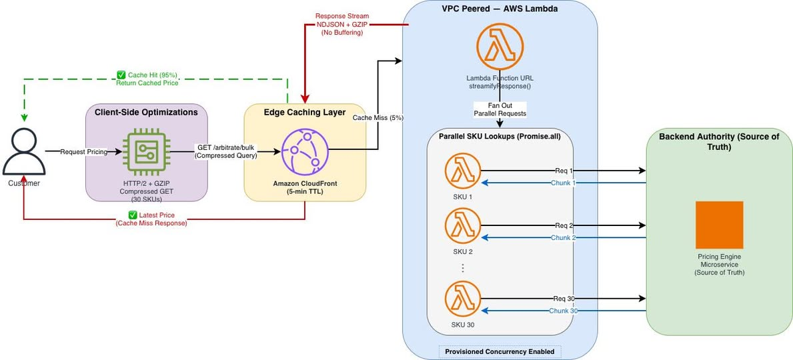

### Nguồn tham khảo & Bài viết đã đăng

- **Bài đăng trên cộng đồng AWS Study Group FCJ:** [Xem bài viết trên Facebook](https://www.facebook.com/groups/awsstudygroupfcj/permalink/2206091146822512/)
- **Bài viết gốc từ AWS Architecture Blog:** [How Samsung achieved real-time pricing with AWS Lambda Response Streaming](https://aws.amazon.com/blogs/architecture/how-samsung-achieved-real-time-pricing-with-aws-lambda-response-streaming/)

---

## Blog 2: [AWS STORAGE] S3 INTELLIGENT-TIERING – KHI LƯU TRỮ DỮ LIỆU TỰ "BIẾT" NÊN NẰM Ở TẦNG NÀO

Khi xây dựng data lake trên S3, một bài toán thường gặp là dữ liệu ngày càng nhiều nhưng mô hình truy cập của từng loại dữ liệu lại rất khó đoán trước - có file được đọc liên tục, có file chỉ đọc vài lần rồi bỏ đó, cũng có file gần như không ai đụng tới sau khi upload. Nếu để tất cả nằm ở S3 Standard thì chi phí sẽ đội lên đáng kể, còn nếu rà soát thủ công để chuyển storage class thì lại tốn công vận hành. **S3 Intelligent-Tiering** ra đời để giải quyết chính bài toán này.

### Ý tưởng cốt lõi

* S3 Intelligent-Tiering tự "quan sát" hành vi truy cập của từng object rồi tự động xếp vào đúng tầng chi phí phù hợp, không cần con người can thiệp
* Thay vì cố dự đoán trước dữ liệu nào sẽ "nguội" để chuyển tầng thủ công, hệ thống tự quan sát hành vi thực tế rồi tự quyết định
* Đặc biệt phù hợp với các data lake có nguồn dữ liệu đa dạng, nơi việc đoán trước pattern truy cập gần như bất khả thi

### 3 tầng hoạt động tự động (không cần cấu hình thêm)

* **Frequent Access** - tầng mặc định khi object mới được tạo, dành cho dữ liệu đang được truy cập thường xuyên
* **Infrequent Access** - nếu object không được đụng tới trong 30 ngày, tự động chuyển xuống tầng này với chi phí thấp hơn
* **Archive Instant Access** - sau 90 ngày không truy cập, object tiếp tục chuyển xuống tầng rẻ hơn nữa, nhưng vẫn truy xuất được ngay lập tức khi cần

### 2 tầng archive không đồng bộ (tùy chọn bật thêm)

* **Archive Access** - sau tối thiểu 90 ngày không truy cập, thời gian phục hồi khoảng 3-5 giờ
* **Deep Archive Access** - sau tối thiểu 180 ngày không truy cập, thời gian phục hồi trong vòng 12 giờ
* Mốc thời gian chuyển tầng linh hoạt, có thể kéo dài tới 730 ngày tùy nhu cầu của từng team

### Về chi phí

* Không tính phí truy xuất dữ liệu (data retrieval) ở bất kỳ tầng nào, kể cả khi object đang nằm ở archive
* Chi phí phát sinh chủ yếu là một khoản phí giám sát nhỏ theo từng object mỗi tháng
* Các object dưới 128 KB được **miễn phí giám sát**, rất có lợi cho hệ thống có nhiều file nhỏ (log, metadata, thumbnail...)

### Khi nào nên dùng, khi nào không

* Phù hợp khi mô hình truy cập dữ liệu khó đoán trước hoặc thay đổi theo thời gian
* Không phải giải pháp tối ưu cho mọi trường hợp: nếu đã biết chắc chắn một tập dữ liệu chỉ đọc một lần rồi lưu trữ lâu dài (ví dụ backup định kỳ), chuyển thẳng sang Glacier hoặc Standard-IA theo cách thủ công có thể tối ưu hơn, vì tránh được khoản phí giám sát hàng tháng (trừ nhóm object dưới 128 KB)

### Bài học rút ra

* Giá trị lớn nhất của Intelligent-Tiering không nằm ở việc rẻ hơn bao nhiêu phần trăm, mà ở việc **thay đổi cách tiếp cận bài toán chi phí lưu trữ**: để hệ thống tự động hóa việc theo dõi và ra quyết định dựa trên dữ liệu hành vi thực tế, thay vì con người phải liên tục giám sát
* Đây là một mảnh ghép phù hợp trong tư duy tối ưu chi phí cloud hiện đại, đặc biệt với các hệ thống data lake có nguồn dữ liệu đa dạng và khó dự đoán

### Hình ảnh minh họa

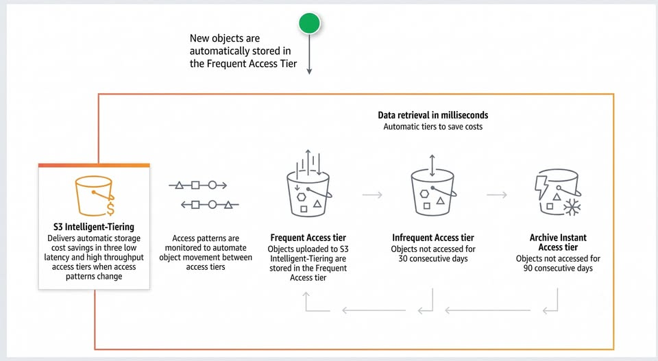

### Nguồn tham khảo
- **Bài đăng trên cộng đồng AWS Study Group FCJ:** [Xem bài viết trên Facebook](https://www.facebook.com/groups/awsstudygroupfcj/permalink/2205182253580068/?rdid=npZRVT1ZR54BwOQp#)
- **Bài viết gốc từ AWS Storage Blog:** [Manage Amazon S3 storage costs granularly and at scale using S3 Intelligent-Tiering](https://aws.amazon.com/vi/blogs/storage/manage-amazon-s3-storage-costs-granularly-and-at-scale-using-s3-intelligent-tiering/)

---

## Blog 3: ĐẢM BẢO CÔNG BẰNG TRONG GAME: PHÁT HIỆN VÀ NGĂN CHẶN GIAN LẬN QUA ẢNH ĐẠI DIỆN VỚI AMAZON TEXTRACT

Trong quá trình phát triển và vận hành các trò chơi trực tuyến nhiều người chơi (multiplayer online games), việc duy trì một môi trường chơi game công bằng và lành mạnh luôn là ưu tiên hàng đầu. Thông thường, các hệ thống bảo mật tập trung vào việc chống hack/cheat trong mã nguồn trò chơi, nhưng lại dễ bỏ qua một hình thức gian lận tinh vi: **lạm dụng ảnh đại diện (profile picture)**. Để ngăn chặn các hành vi nhúng thông tin liên lạc trái phép vào ảnh đại diện, AWS đã đề xuất một kiến trúc **Serverless** sử dụng **Amazon Textract** để tự động quét, phát hiện và làm mờ văn bản ngay khi hình ảnh được tải lên.

### Vấn đề: Giới hạn của phương pháp kiểm duyệt truyền thống

* Người chơi có hành vi gian lận thường nhúng số điện thoại, đường dẫn Discord, hoặc mã phòng chat riêng tư trực tiếp vào ảnh đại diện để liên lạc bí mật, thông đồng gian lận theo cặp hoặc lôi kéo người chơi ra khỏi hệ thống
* Cách làm truyền thống: tự triển khai máy chủ riêng (như EC2) chạy các thư viện xử lý ảnh nặng (OpenCV) hoặc tự huấn luyện mô hình OCR
* Ba hạn chế lớn của phương pháp truyền thống:
  * **Chi phí duy trì cao**: Phải duy trì máy chủ xử lý hoạt động 24/7 kể cả khi tần suất tải ảnh của người dùng không cao
  * **Hiệu năng chậm và nghẽn cổ chai**: Hệ thống dễ bị quá tải khi có lượng lớn người chơi đăng ký mới hoặc tải ảnh đồng loạt
  * **Độ chính xác hạn chế**: Khó nhận diện chính xác các kiểu chữ viết tay, phông chữ cách điệu trong game hoặc văn bản bị biến dạng màu sắc

### Hướng đi mới: Kiến trúc Serverless tự động hóa với Amazon Textract

* Thay vì tự quản lý máy chủ OCR phức tạp, hệ thống sử dụng mô hình **Serverless** kết hợp dịch vụ AI được quản lý (**Amazon Textract**) để xử lý hình ảnh hoàn toàn tự động theo luồng sự kiện
* Luồng hoạt động:
  1. **Tải ảnh lên (Upload)**: Người dùng tải ảnh đại diện lên Amazon S3 Bucket chính (Primary Bucket), sự kiện này ngay lập tức kích hoạt hàm AWS Lambda
  2. **Trích xuất tọa độ văn bản**: Hàm Lambda gửi hình ảnh sang **Amazon Textract**. Dịch vụ AI này tự động phân tích, phát hiện toàn bộ văn bản (cả in ấn lẫn viết tay) và trả về tọa độ chính xác (Bounding Boxes) của các vùng chứa văn bản
  3. **Xử lý làm mờ tự động**: Lambda nhận tọa độ văn bản, sử dụng bộ lọc Gaussian Blur để làm mờ chính xác các vùng chứa thông tin nhạy cảm
  4. **Lưu trữ an toàn**: Hình ảnh đã làm mờ được lưu tạm thời vào một S3 processing bucket (để tránh vòng lặp kích hoạt sự kiện vô hạn), sau đó ghi đè lên hình ảnh gốc trong Primary Bucket
  5. **Gửi cảnh báo**: **Amazon SNS** gửi thông báo qua email đến đội ngũ quản trị game (Game Admin) kèm thông tin tài khoản vừa cố tình nhúng văn bản vào ảnh đại diện

### Một số kỹ thuật triển khai đáng chú ý

* **Kiến trúc hướng sự kiện (Event-driven)**: Sử dụng S3 Event Notifications kích hoạt Lambda chỉ khi có ảnh mới được tải lên, loại bỏ hoàn toàn chi phí máy chủ nhàn rỗi
* **Độ chính xác cao từ AI được quản lý**: Amazon Textract xử lý nhận diện văn bản vượt trội trên nhiều ngôn ngữ, phông chữ phức tạp và chữ viết tay
* **Kiểm duyệt tự động không ảnh hưởng trải nghiệm**: Chỉ áp dụng làm mờ (Gaussian Blur) đúng vùng chứa văn bản vi phạm, giữ nguyên chất lượng thẩm mỹ của phần hình ảnh còn lại
* **Khả năng tự động mở rộng (Auto-scaling)**: Lambda và Textract tự động mở rộng theo lưu lượng thực tế, xử lý mượt mà ngay cả trong thời gian cao điểm
* **Tối ưu chi phí theo mức sử dụng (Pay-per-use)**: Chỉ trả phí cho số mili-giây thực thi Lambda và số lượng ảnh thực sự được quét qua Textract

### Bài học rút ra

* Thay vì tự viết và bảo trì các bộ lọc hay mô hình AI phức tạp từ đầu, việc tận dụng các **dịch vụ AI được quản lý sẵn trên đám mây** mang lại độ chính xác cao hơn và tiết kiệm đáng kể thời gian phát triển
* Tư duy **Serverless kết hợp Event-driven** là lời giải tối ưu cho các bài toán kiểm duyệt nội dung người dùng (UGC), đảm bảo cả ba yếu tố: tốc độ xử lý nhanh, bảo mật tự động và chi phí vận hành tối ưu

### Hình ảnh minh họa kiến trúc

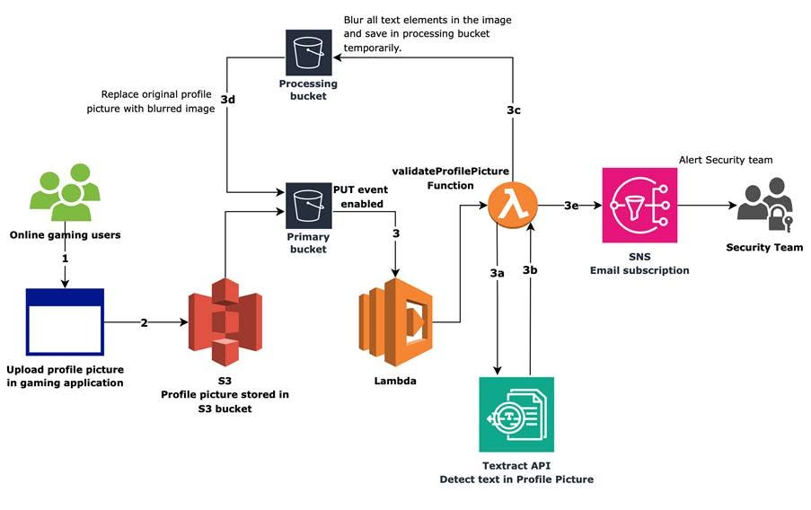

### Nguồn tham khảo & Bài viết đã đăng

- **Bài đăng trên cộng đồng AWS Study Group FCJ:** [Xem bài viết trên Facebook]()
- **Bài viết gốc từ AWS GameTech Blog:** [Ensuring fair play by detecting and preventing profile alterations with Amazon Textract](https://aws.amazon.com/blogs/gametech/ensuring-fair-play-by-detecting-and-preventing-profile-alterations-with-amazon-textract/)

---

# PHẦN 4: CÁC EVENTS ĐÃ THAM GIA

Trong quá trình thực tập em đã tham gia 2 events, mỗi event là một trải nghiệm đáng nhớ với những kiến thức mới, hay và bổ ích, cùng với buổi chia sẻ kiến thức của anh chị đi trước tại AWS giúp em mở rộng hơn suy nghĩ về ngành nghề của mình và xu hướng thị trường hiện tại.

<div style="text-align: left;">

#### Danh sách events

#### 1. [Event 1](4.1-Event1/)
&emsp;**Tên sự kiện:** FCAJ Community Day - Conference Call - Tháng 5  
&emsp;**Thời gian:** 09:00 ngày 23/05/2026  
&emsp;**Địa điểm:** Tầng 36, tòa nhà Bitexco, số 02 đường Hải Triều, phường Sài Gòn, thành phố Hồ Chí Minh  
&emsp;**Vai trò trong sự kiện:** Người tham dự  

#### 2. [Event 2](4.2-Event2/)
&emsp;**Tên sự kiện:** FCAJ Community Day - Tháng 6  
&emsp;**Thời gian:** 09:00 ngày 27/06/2026  
&emsp;**Địa điểm:** Tầng 26, tòa nhà Bitexco, số 02 đường Hải Triều, phường Sài Gòn, thành phố Hồ Chí Minh  
&emsp;**Vai trò trong sự kiện:** Người tham dự  

</div>

---

## Event 1: Bài thu hoạch "FCAJ Community Day - Conference Call - May"

### Mục Đích Của Sự Kiện

- Kết nối cộng đồng thực tập sinh FCAJ (First Cloud AI Journey) thông qua các buổi chia sẻ trực tiếp tại Bitexco Financial Tower
- Cập nhật xu hướng ứng dụng AI vào xây dựng sản phẩm và vận hành hệ thống
- Giới thiệu các dịch vụ nền tảng của AWS (CloudFront, Amazon Quick) và cách khai thác trong thực tế
- Chia sẻ kinh nghiệm thực chiến từ các dự án hackathon và bài toán doanh nghiệp (credit scoring cho startup)

### Danh Sách Diễn Giả

- Đại diện đội ngũ AWS và cộng đồng FCAJ phụ trách các chủ đề: Context Engineering & AI, CloudFront, Amazon Quick, LLM Determinism, Multi-Agent System
- Đội thi đến từ LotusHacks Hackathon chia sẻ hành trình xây dựng sản phẩm UTMorpho
- *(Thông tin tên cụ thể của từng diễn giả sẽ được bổ sung theo tài liệu chương trình chính thức của sự kiện)*

### Nội Dung Nổi Bật

#### Context Is Everything: Making AI Actually Work for You

- Lý do vì sao AI "thất bại" khi thiếu context, và context thực sự có nghĩa là gì trong tương tác với AI
- Sự chuyển dịch từ prompt engineering đơn thuần sang khái niệm "Second AI Brain" - AI có khả năng ghi nhớ và học hỏi theo thời gian
- Mối liên hệ giữa chất lượng context đầu vào và chất lượng kết quả đầu ra của AI
- Định hướng nghề nghiệp cho sinh viên muốn bắt đầu xây dựng sản phẩm với AI

#### 36 hrs với LotusHacks – Building UTMorpho from Idea to Reality

- Hành trình từ ý tưởng ban đầu đến khi định hình rõ bài toán mà UTMorpho giải quyết
- Áp lực và kỷ luật cần có khi phát triển sản phẩm trong 36 giờ liên tục
- Những thất bại, điểm nghẽn và các bước ngoặt (turning points) trong quá trình phát triển
- Demo tổng quan sản phẩm UTMorpho và các bài học rút ra sau cuộc thi

#### From Edge To Origin: CloudFront as Your Foundation

- Amazon CloudFront phù hợp với nhiều loại workload khác nhau, không chỉ dừng ở phân phối nội dung tĩnh
- Chiến lược tối ưu chi phí (cost optimization) khi sử dụng CloudFront
- Các khả năng bảo mật tích hợp sẵn giúp bảo vệ ứng dụng ở lớp edge
- Cải thiện độ tin cậy (reliability) và hiệu năng (performance) cho hệ thống nhờ kiến trúc phân tán toàn cầu

#### Friendly AI Assistant with Amazon Quick

- **Quick Chat Agent**: trợ lý AI hỗ trợ khai thác dữ liệu và phân tích insight
- **Quick Flows**: tạo workflow thông minh bằng ngôn ngữ tự nhiên, không cần viết code
- **Quick Spaces**: không gian cộng tác giúp biến insight cá nhân thành tri thức chung của team
- **Quick Sight**: xây dựng dashboard và báo cáo từ dữ liệu thô bằng ngôn ngữ tự nhiên

#### Non-Determinism of "Deterministic" LLM Settings

- Cách LLM lựa chọn token tiếp theo trong quá trình sinh văn bản
- Giả định phổ biến: Temperature = 0 sẽ đảm bảo tính xác định (determinism) tuyệt đối
- Thực tế: các tối ưu hóa ở tầng inference (batching, phần cứng, floating-point) khiến kết quả vẫn có thể khác nhau
- Tác động thực tế đến các hệ thống production và chiến lược giảm thiểu rủi ro này

#### Enterprise-Grade Multi-Agent System: The Case of Startup Credit Scoring

- Sự lệch pha giữa cấu trúc dữ liệu ngân hàng truyền thống và đặc thù dữ liệu của startup
- Khi nào nên dùng single agent và khi nào cần chuyển sang multi-agent
- Mô hình "Virtual Credit Committee" - nhiều agent đóng vai trò khác nhau trong quy trình thẩm định tín dụng
- Các rào chắn (guardrails) và yêu cầu tuân thủ (compliance) cần thiết khi triển khai AI trong lĩnh vực tài chính
- ROI vận hành và lộ trình triển khai thực tế

### Những Gì Học Được

#### Tư Duy Về AI & Sản Phẩm

- Context là yếu tố quyết định chất lượng output của AI, không chỉ đơn thuần là prompt hay hơn
- Sản phẩm tốt thường ra đời từ áp lực thời gian và khả năng ra quyết định nhanh (bài học từ LotusHacks)
- AI đang dịch chuyển từ công cụ hỗ trợ đơn lẻ sang hệ thống có trí nhớ và khả năng suy luận liên tục

#### Kiến Trúc & Hạ Tầng

- CloudFront không chỉ là CDN mà còn là lớp nền tảng cho bảo mật, hiệu năng và tối ưu chi phí
- Hiểu rõ hơn về rủi ro non-determinism trong LLM, đặc biệt quan trọng khi xây dựng hệ thống cần khả năng tái lặp (reproducibility)
- Multi-agent system là hướng tiếp cận phù hợp cho các bài toán nghiệp vụ phức tạp, nhiều bước ra quyết định như credit scoring

#### Ứng Dụng AI Trong Doanh Nghiệp

- Amazon Quick cho thấy xu hướng "AI hóa" các tác vụ vận hành và phân tích dữ liệu mà không cần kỹ năng lập trình
- Việc thiết kế guardrails và compliance là bắt buộc khi đưa AI vào các lĩnh vực nhạy cảm như tài chính

### Ứng Dụng Vào Công Việc

- Áp dụng tư duy "context-first" khi thiết kế prompt và pipeline AI cho các tác vụ hiện tại
- Cân nhắc sử dụng CloudFront cho các workload cần tối ưu chi phí và độ trễ trong dự án đang thực tập
- Lưu ý về non-determinism khi kiểm thử và đánh giá kết quả từ LLM, tránh giả định kết quả luôn giống nhau dù cùng cấu hình
- Tham khảo mô hình multi-agent khi thiết kế các workflow tự động hóa nhiều bước
- Tìm hiểu thêm Amazon Quick như một công cụ tiềm năng hỗ trợ báo cáo và phân tích dữ liệu nội bộ

### Trải nghiệm trong event

Tham gia **FCAJ Community Day - Conference Call** tại Bitexco Financial Tower là một trải nghiệm đáng nhớ, giúp tôi được tiếp cận trực tiếp với các xu hướng công nghệ mới nhất từ AWS cũng như những câu chuyện thực chiến từ cộng đồng.

#### Kết nối cộng đồng

- Được gặp gỡ và trao đổi trực tiếp với các bạn thực tập sinh khác trong chương trình FCAJ, cũng như đội ngũ mentor và diễn giả
- Không khí sự kiện cởi mở, tạo cảm hứng cho việc học hỏi và chia sẻ kinh nghiệm

#### Trải nghiệm học thuật và kỹ thuật

- Buổi chia sẻ về "Context Is Everything" giúp tôi thay đổi cách tiếp cận khi làm việc với AI, không chỉ dừng ở việc viết prompt mà còn quan tâm đến cách cung cấp và quản lý context
- Câu chuyện từ đội LotusHacks về UTMorpho là nguồn cảm hứng lớn về tinh thần "làm thật, học thật" trong môi trường áp lực cao
- Phần trình bày về non-determinism của LLM khiến tôi nhìn nhận lại các giả định trước đây về tính ổn định của mô hình AI

#### Bài học rút ra

- AI không chỉ là công cụ mà đang dần trở thành một phần hạ tầng cần được thiết kế cẩn trọng, từ context, độ tin cậy cho đến compliance
- Việc kết hợp kiến thức nền tảng (cloud, kiến trúc hệ thống) với AI mới thực sự tạo ra giá trị bền vững cho doanh nghiệp

#### Một số hình ảnh khi tham gia sự kiện
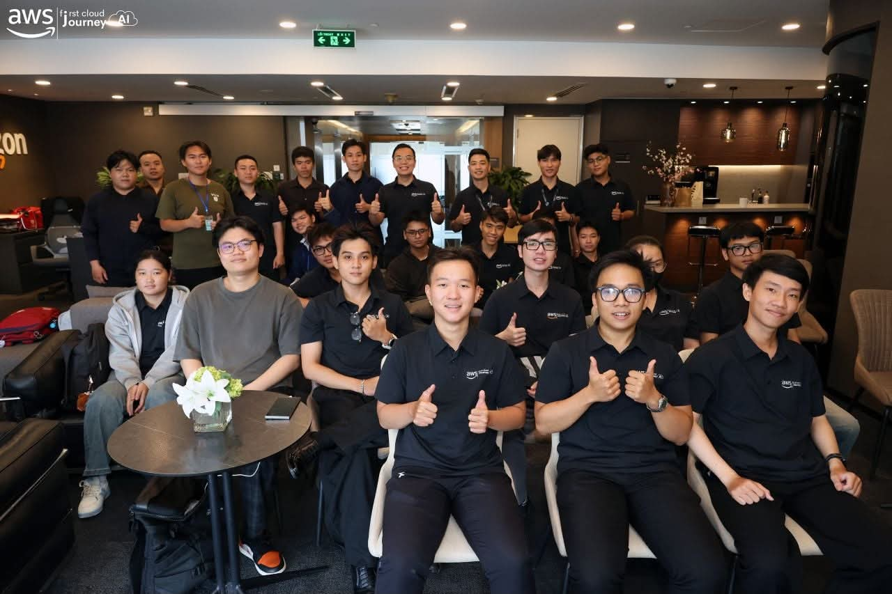

---

## Event 2: Bài thu hoạch "FCAJ Community Day - June"

### Mục Đích Của Sự Kiện

- Tiếp nối chuỗi sự kiện cộng đồng của chương trình FCAJ, cập nhật các giải pháp AI mới nhất trong vận hành hệ thống (Operations), giọng nói (Voice AI) và quản trị nhân sự (HR)
- Giới thiệu các dịch vụ và kiến trúc mới của AWS: DevOps Agent, Amazon Nova Sonic, Amazon Quick với khả năng kết nối MCP an toàn
- Chia sẻ các use case thực tế và demo trực tiếp để minh họa khả năng ứng dụng AI vào vận hành doanh nghiệp

### Danh Sách Diễn Giả

- Đại diện đội ngũ AWS phụ trách các chủ đề: Cloud Operations & AIOps, Voice AI, DevOps Agent, HR Analytics, Amazon Quick & MCP Security
- *(Thông tin tên cụ thể của từng diễn giả sẽ được bổ sung theo tài liệu chương trình chính thức của sự kiện)*

### Nội Dung Nổi Bật

#### Deep Response Engine: From Detection to Autonomous Resolution

- "Bức tường phức tạp" (complexity wall) mà các hệ thống vận hành cloud hiện đại đang gặp phải
- Sự chuyển dịch từ mô hình alert-driven (chỉ cảnh báo) sang action-driven (tự động hành động)
- Tổng quan kiến trúc của Deep Response Engine
- Demo trực tiếp quy trình xử lý sự cố (incident response) hoàn toàn tự động
- Tác động kinh doanh: giảm chi phí vận hành và hướng tới zero-downtime

#### Voice Agents: Building Human-Like AI Conversations at Scale

- Quá trình tiến hóa từ hệ thống IVR truyền thống, chatbot đến AI voice agent hiện đại
- Các thách thức cốt lõi: độ trễ (latency), độ chính xác (accuracy) và tính tự nhiên trong hội thoại
- Giới thiệu Amazon Nova Sonic - mô hình nền tảng speech-to-speech
- Kiến trúc tổng thể: telephony, streaming, Bedrock và các công cụ MCP
- Các use case doanh nghiệp, best practices và demo trực tiếp

#### AWS DevOps Agent: Your Always-Available Operations Teammate

- Tổng quan về AWS DevOps Agent như một "đồng đội vận hành" luôn sẵn sàng
- Giảm MTTD (thời gian phát hiện sự cố) và MTTR (thời gian khắc phục sự cố) nhờ AI
- Khả năng hỗ trợ môi trường multi-cloud và hybrid
- Kiến trúc Bedrock AgentCore và cách tiếp cận multi-agent reasoning
- Các use case thực tế và demo triển khai trên ECS

#### AI-Powered Productivity: Workforce Planning For Enterprise

- Các thách thức trong chuyển đổi số của bộ phận HR tại doanh nghiệp hiện đại
- Tổng quan về Amazon Quick và các khả năng ứng dụng trong HR
- Tăng tốc vận hành HR nhờ tự động hóa các tác vụ lặp lại
- Phân tích dữ liệu nhân sự (workforce analytics) để đưa ra insight
- Lập kế hoạch nhân sự chiến lược dựa trên dữ liệu cho cấp doanh nghiệp

#### Building Secure Private MCP Connection with Amazon Quick

- Giới thiệu Amazon Quick như một nền tảng trợ lý AI toàn diện
- Vai trò của MCP (Model Context Protocol) trong việc mở rộng khả năng của AI assistant
- Các thách thức bảo mật khi tích hợp hệ thống qua MCP
- Cấu hình kết nối riêng tư (private connectivity) qua VPC cho Amazon Quick
- Demo và các bài học triển khai thực tế

### Những Gì Học Được

#### Vận Hành Hệ Thống Thông Minh (AIOps)

- Xu hướng chuyển từ giám sát bị động sang hệ thống có khả năng tự phản ứng và tự khắc phục sự cố
- Vai trò của multi-agent reasoning trong việc xử lý các tình huống vận hành phức tạp, đa bước

#### Voice AI & Trải Nghiệm Người Dùng

- Xây dựng voice agent tự nhiên đòi hỏi tối ưu đồng thời cả độ trễ, độ chính xác và trải nghiệm hội thoại
- Speech-to-speech foundation model (Nova Sonic) là bước tiến giúp rút ngắn pipeline so với cách tiếp cận STT → LLM → TTS truyền thống

#### Ứng Dụng AI Trong Quản Trị Doanh Nghiệp

- HR cũng là một lĩnh vực tiềm năng để ứng dụng AI, không chỉ giới hạn ở kỹ thuật hay vận hành hệ thống
- Bảo mật khi mở rộng AI assistant qua MCP là yếu tố bắt buộc phải cân nhắc ngay từ khâu thiết kế kiến trúc, đặc biệt với private connectivity

### Ứng Dụng Vào Công Việc

- Tham khảo mô hình action-driven khi thiết kế các quy trình giám sát và cảnh báo cho hệ thống đang thực tập
- Ghi nhận Amazon Nova Sonic và kiến trúc voice agent như một hướng tham khảo nếu dự án có nhu cầu tương tác thoại
- Áp dụng tư duy giảm MTTD/MTTR khi xây dựng quy trình vận hành, hướng tới tự động hóa nhiều hơn là chỉ cảnh báo thủ công
- Cân nhắc sử dụng Amazon Quick cho các tác vụ báo cáo, phân tích dữ liệu nội bộ mà không cần viết code
- Lưu ý các nguyên tắc bảo mật khi tích hợp AI assistant với hệ thống nội bộ qua MCP, đặc biệt là cấu hình private connectivity

### Trải nghiệm trong event

Tham gia **FCAJ Community Day - June** là cơ hội để tôi tiếp tục cập nhật các giải pháp AI mới nhất mà AWS đang phát triển, đặc biệt trong các lĩnh vực vận hành hệ thống, voice AI và quản trị doanh nghiệp.

#### Trải nghiệm học thuật và kỹ thuật

- Phần trình bày về Deep Response Engine cho tôi thấy rõ khoảng cách giữa một hệ thống "biết cảnh báo" và một hệ thống "biết hành động", đây là hướng đi quan trọng cho các đội vận hành trong tương lai
- Demo về Voice Agents với Amazon Nova Sonic giúp tôi hình dung cụ thể hơn về kiến trúc speech-to-speech và các thách thức thực tế khi triển khai ở quy mô lớn
- Buổi chia sẻ về bảo mật MCP với Amazon Quick nhấn mạnh rằng mở rộng khả năng AI luôn phải đi kèm với chiến lược bảo mật rõ ràng

#### Kết nối cộng đồng

- Được tiếp tục giao lưu với các bạn thực tập sinh FCAJ và đội ngũ AWS, duy trì mạch kết nối từ sự kiện tháng 5
- Không khí trao đổi thẳng thắn trong các phần Q&A giúp tôi hiểu sâu hơn về các vấn đề triển khai thực tế mà tài liệu chính thức đôi khi không đề cập tới

#### Bài học rút ra

- AI đang len lỏi vào mọi ngóc ngách của vận hành doanh nghiệp, từ hạ tầng kỹ thuật (DevOps, monitoring) đến các phòng ban nghiệp vụ (HR)
- Bảo mật và khả năng mở rộng (extensibility) luôn phải được cân nhắc song song khi thiết kế hệ thống AI, không thể đánh đổi cái này lấy cái kia

#### Một số hình ảnh khi tham gia sự kiện
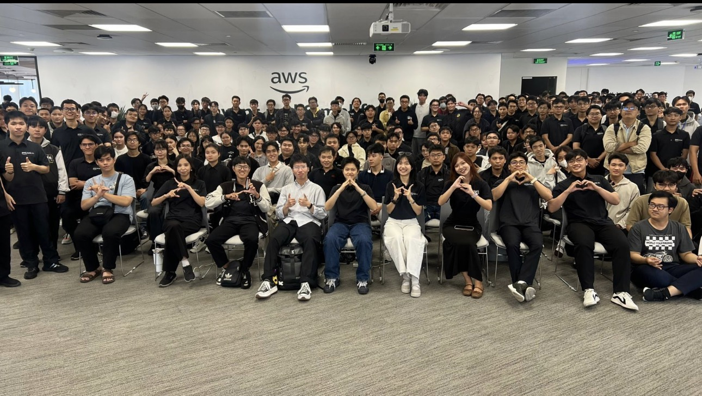

---

# PHẦN 5: WORKSHOP

<div style="text-align: left;">

#### Tóm tắt về workshop

Workshop này hướng dẫn bạn xây dựng một luồng xử lý ảnh bất đồng bộ (asynchronous) theo mô hình Event‑Driven trên AWS, giải quyết bài toán “nhiều người dùng upload ảnh cùng lúc” nhưng vẫn đảm bảo hệ thống ổn định, dễ mở rộng và kiểm soát chi phí.

#### Nội dung

1. [5.1 — Tổng quan Workshop](5.1-WorkshopOverview/)
2. [5.2 — Bước 1: Chuẩn bị IAM Role cho Lambda](5.2-Step1/)
3. [5.3 — Bước 2: Tạo hàng đợi tin nhắn Amazon SQS](5.3-Step2/)
4. [5.4 — Bước 3: Cấu hình lưu trữ và sự kiện Amazon S3](5.4-Step3/)
5. [5.5 — Bước 4: Tạo và viết code cho AWS Lambda](5.5-Step4/)
6. [5.6 — Bước 5: Kiểm thử hệ thống](5.6-Step5/)
7. [5.7 — Bước 6: Dọn dẹp tài nguyên](5.7-Step6/)

</div>

---

## Tổng quan Workshop: Xây dựng luồng xử lý hình ảnh bất đồng bộ sử dụng Amazon S3, SQS và AWS Lambda

### Tóm tắt về workshop

Workshop này hướng dẫn bạn xây dựng một luồng xử lý ảnh bất đồng bộ (asynchronous) theo mô hình Event‑Driven trên AWS, giải quyết bài toán “nhiều người dùng upload ảnh cùng lúc” nhưng vẫn đảm bảo hệ thống ổn định, dễ mở rộng và kiểm soát chi phí.

---

### Mục tiêu chính   

- Thiết kế kiến trúc **S3 → SQS → Lambda** để xử lý ảnh theo hàng đợi, tránh Lambda bị gọi ồ ạt khi có nhiều upload đồng thời.
- Viết Lambda (Python) để:
  - Nhận message từ SQS (chứa sự kiện từ S3)
  - Tải ảnh từ S3
  - Gọi Amazon Rekognition để gợi ý nhãn/nhận diện tình trạng (ví dụ: kiện hàng hư hỏng)
  - Gọi Amazon Textract để trích xuất văn bản trên nhãn dán (mã vận đơn, thông tin tuyến, SĐT, …)
  - Ghi kết quả ra CloudWatch Logs để quan sát và kiểm thử
### Bạn sẽ học được gì
  - Vì sao cần SQS làm “buffer” giữa S3 và Lambda trong hệ thống có tải cao.
  - Cách cấu hình IAM Role theo nguyên tắc Least Privilege (cấp đúng quyền cần thiết).
  - Cách tạo & cấu hình:
    - S3 bucket và Event Notification
    - SQS Standard Queue với các thông số quan trọng (Visibility Timeout, retention…)
    - Lambda Trigger từ SQS và xử lý từng message (batch size nhỏ để dễ quan sát)
  - Quy trình Testing & Validation end‑to‑end và Clean up tài nguyên để tránh phát sinh chi phí.

---

## Bước 1: Chuẩn bị IAM Role cho Lambda

### Giới thiệu

IAM Role là quyền mà Lambda sử dụng để truy cập các dịch vụ AWS cần thiết trong workshop như Amazon S3, Amazon SQS, Amazon Rekognition và Amazon Textract.

Trong bước này, bạn sẽ tạo một IAM Role cho Lambda và gắn các policy cần thiết để Lambda có thể đọc dữ liệu, nhận message và ghi log trong quá trình xử lý ảnh.

---

### Các bước thực hiện

1. Truy cập **AWS Console**, tìm dịch vụ **IAM**.

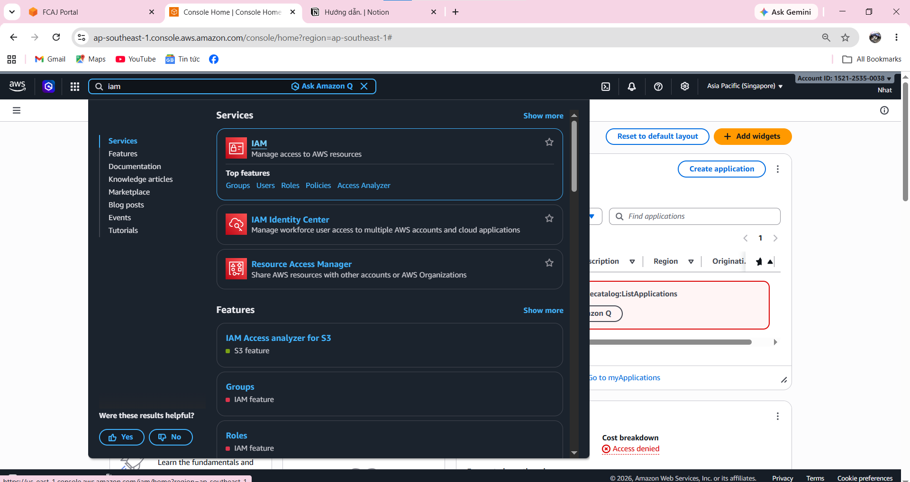

2. Chọn **Roles**, sau đó chọn **Create role**.

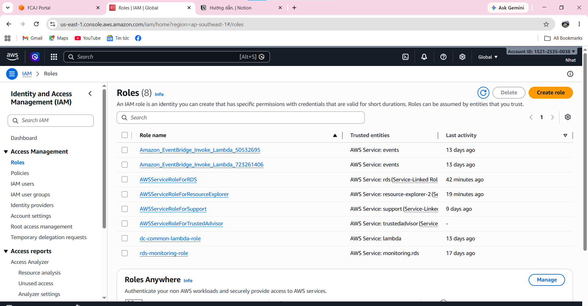

3. Ở phần **Trusted entity type**, chọn **AWS service**.

4. Ở phần **Use case**, chọn **Lambda**, sau đó chọn **Next**.

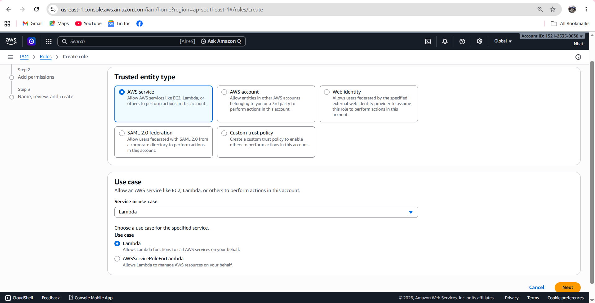

5. Tìm và gắn lần lượt các policy cần thiết cho Lambda.

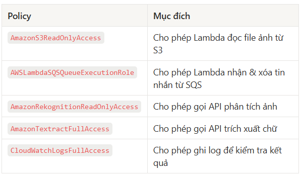

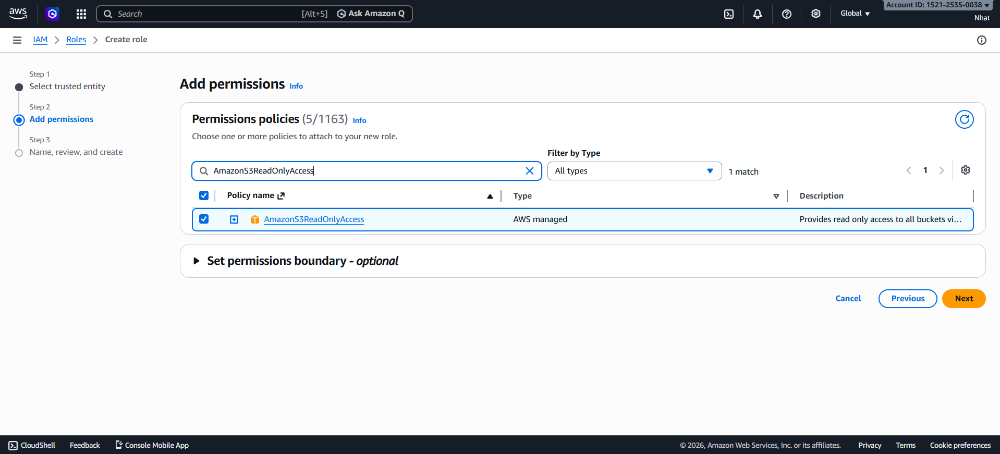

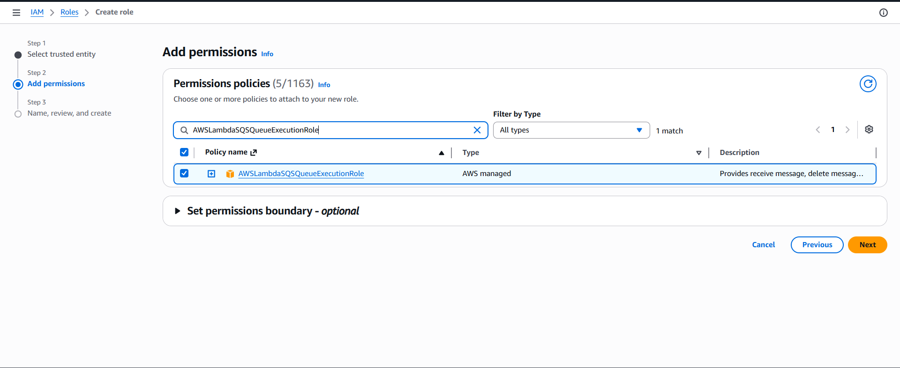

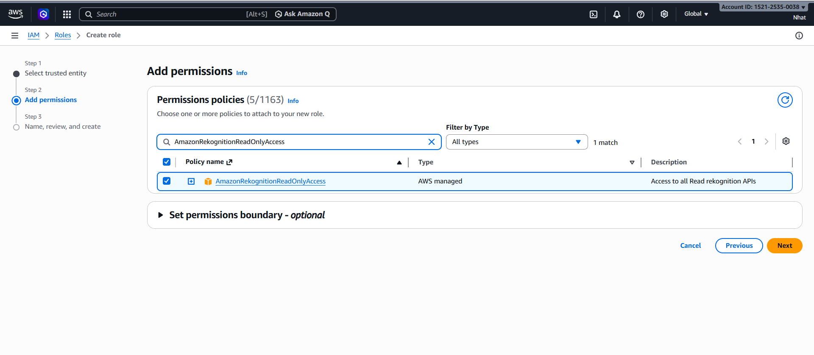

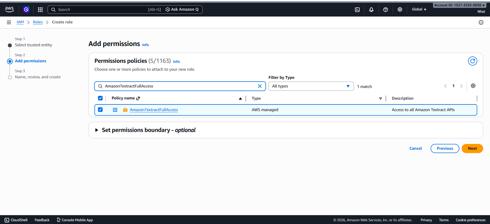

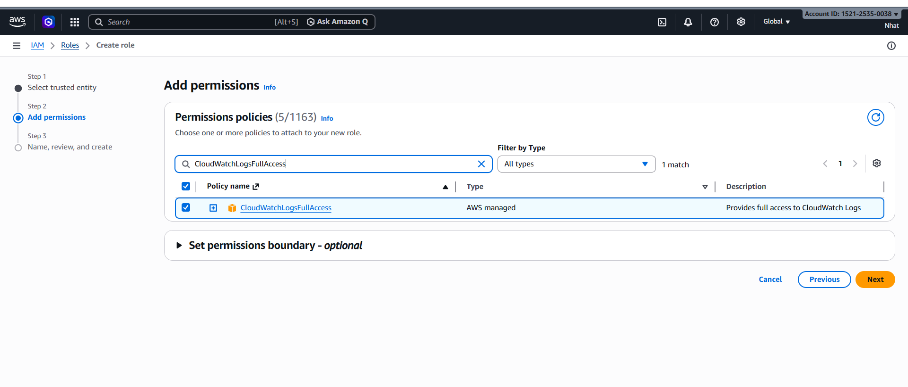

6. Đặt tên role là **Lambda-ImageProcessing-Role**, sau đó chọn **Create role**.

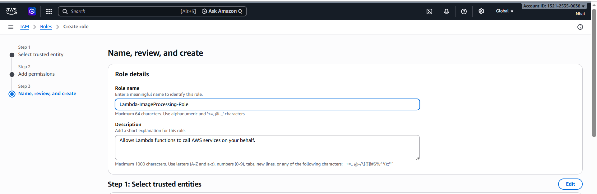

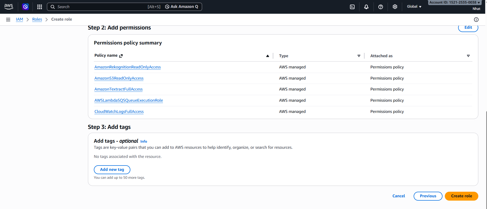

---

### Lưu ý bảo mật

Trong môi trường thực tế, thay vì dùng policy có sẵn của AWS, bạn nên tự viết **Custom Policy** để giới hạn quyền chỉ trên đúng bucket hoặc queue cụ thể.

Đây là best practice bảo mật theo nguyên tắc **Least Privilege**, tức là chỉ cấp đúng quyền cần thiết và không cấp dư quyền.

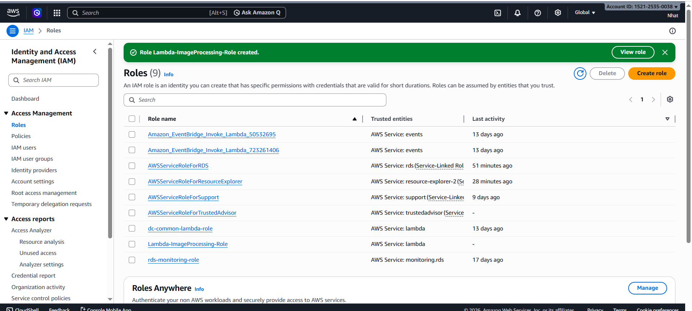

---

## Bước 2: Tạo hàng đợi tin nhắn Amazon SQS

### Giới thiệu

Amazon SQS đóng vai trò là hàng đợi trung gian giữa Amazon S3 và AWS Lambda.

Khi người dùng tải ảnh lên S3, S3 sẽ gửi thông báo vào SQS. Lambda sẽ đọc message từ SQS và xử lý dần dần, giúp hệ thống ổn định hơn khi có nhiều ảnh được tải lên cùng lúc.

---

### Các bước thực hiện

1. Truy cập **AWS Console**, tìm dịch vụ **Amazon SQS**, sau đó chọn **Create queue**.

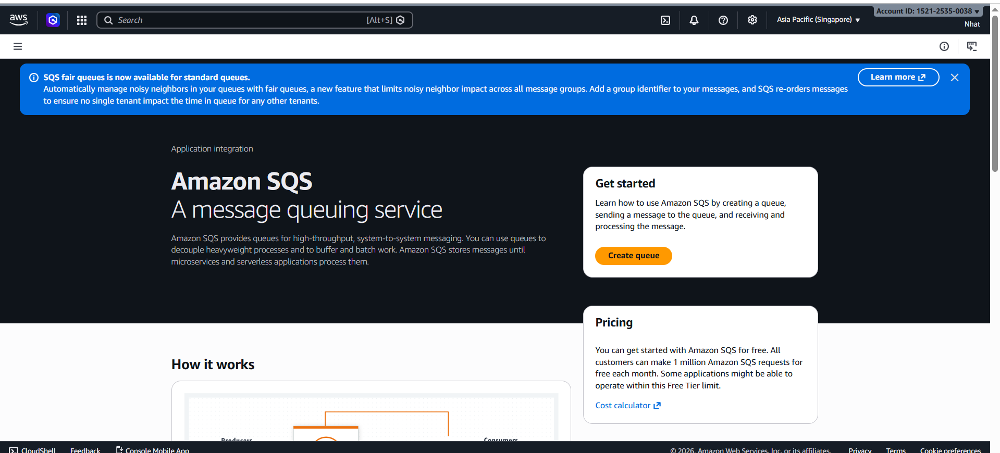

2. Chọn loại queue là **Standard Queue**.

Không chọn **FIFO Queue** trong workshop này vì mục tiêu là xử lý ảnh bất đồng bộ với khả năng mở rộng cao, không yêu cầu thứ tự tuyệt đối.

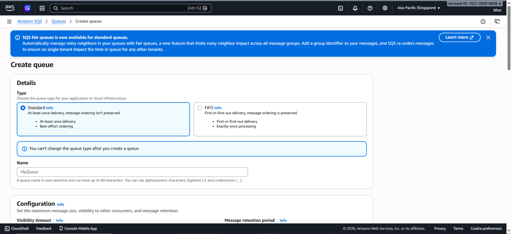

3. Đặt tên queue là **image-processing-queue**.

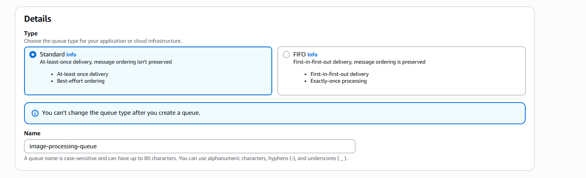

4. Cấu hình các thông số quan trọng cho queue.

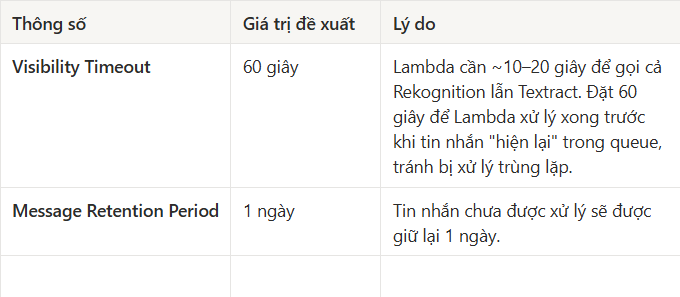

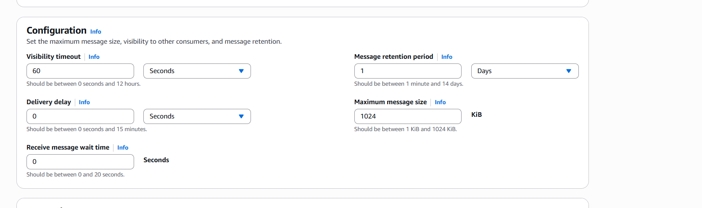

5. Chọn **Create queue** để tạo hàng đợi.

6. Sau khi tạo xong, copy lại **ARN** của queue. ARN này sẽ được dùng ở bước cấu hình S3 Event Notification.

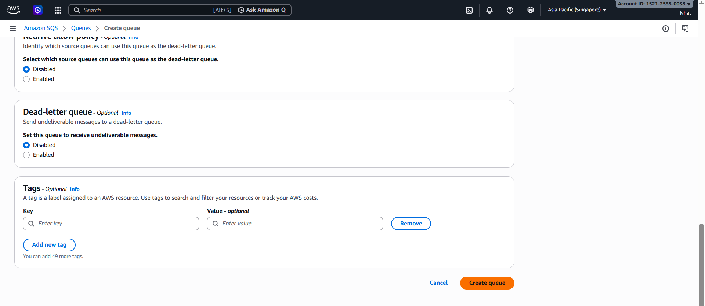

---

## Bước 3: Cấu hình lưu trữ và sự kiện Amazon S3

### Mục tiêu

Trong bước này, bạn sẽ tạo S3 bucket để lưu ảnh và cấu hình để mỗi khi có ảnh mới được tải lên, Amazon S3 tự động gửi thông báo vào SQS queue đã tạo ở bước trước.

---

### 3.1 - Tạo S3 Bucket

1. Truy cập **Amazon S3**, sau đó chọn **Create bucket**.

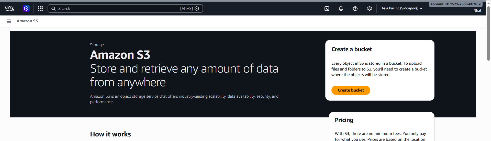

2. Đặt tên bucket theo định dạng **logistics-raw-images-&lt;tên-bạn&gt;**.

Tên bucket phải là duy nhất trên toàn bộ AWS.

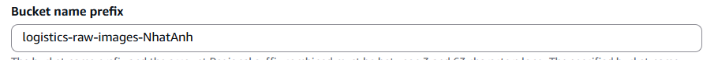

3. Chọn Region **ap-southeast-1 (Singapore)** để gần Việt Nam.

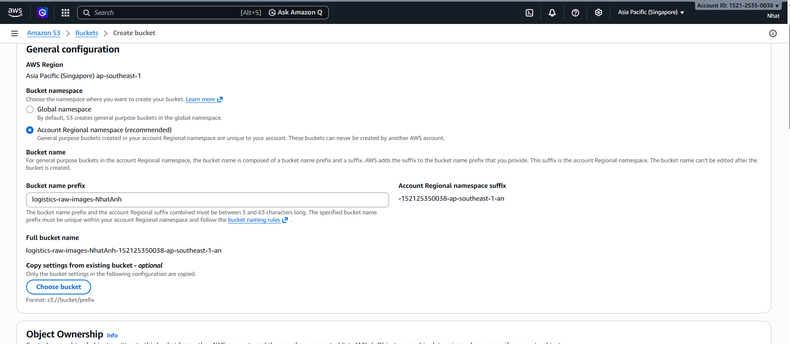

4. Giữ nguyên các cài đặt mặc định, sau đó chọn **Create bucket**.

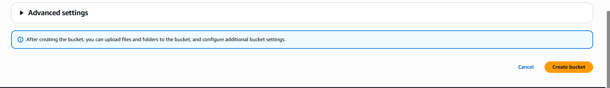

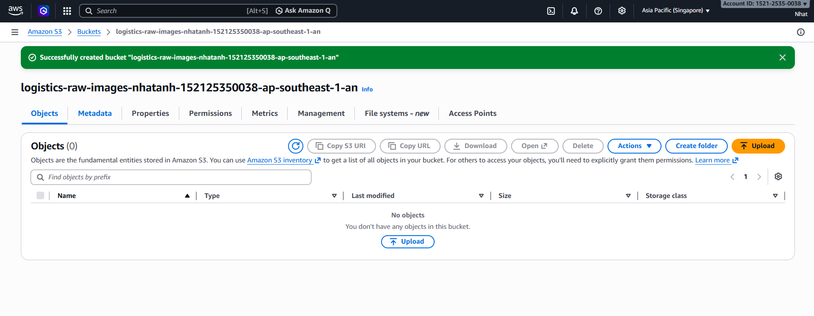

---

### 3.2 - Cấp quyền cho S3 gửi thông báo vào SQS

1. Vào **SQS Console**, chọn queue **image-processing-queue**.

2. Mở tab **Access policy**, chọn chỉnh sửa policy.

3. Thêm policy cho phép S3 gửi message vào SQS.

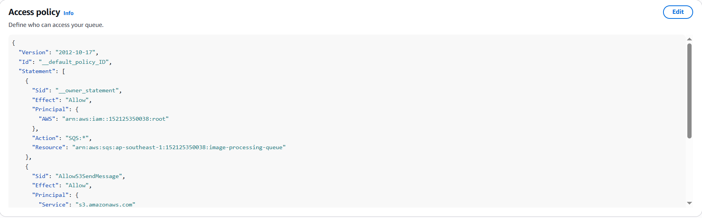

Ví dụ policy:

```json
{
  "Version": "2012-10-17",
  "Statement": [
    {
      "Effect": "Allow",
      "Principal": {
        "Service": "s3.amazonaws.com"
      },
      "Action": "sqs:SendMessage",
      "Resource": "arn:aws:sqs:ap-southeast-1:<account-id>:image-processing-queue",
      "Condition": {
        "ArnLike": {
          "aws:SourceArn": "arn:aws:s3:::logistics-raw-images-<ten-ban>"
        }
      }
    }
  ]
}
```

Thay **&lt;account-id&gt;** bằng AWS Account ID của bạn và thay **logistics-raw-images-&lt;ten-ban&gt;** bằng tên bucket đã tạo.

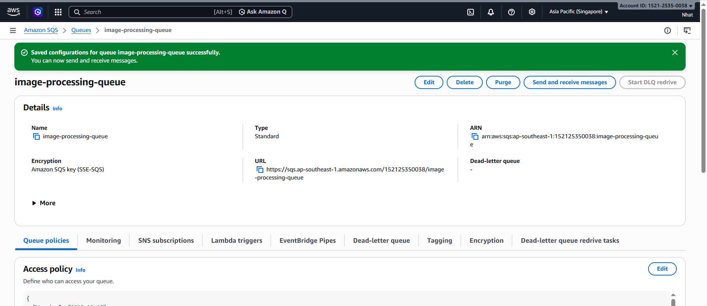

---

### 3.3 - Cấu hình S3 Event Notification

1. Vào bucket vừa tạo, mở tab **Properties**, kéo xuống phần **Event notifications**, sau đó chọn **Create event notification**.

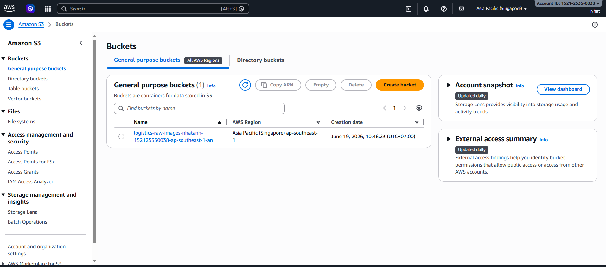

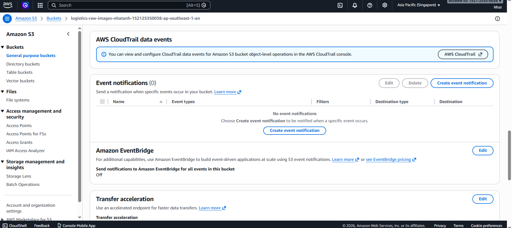

2. Đặt tên event là **new-image-uploaded**.

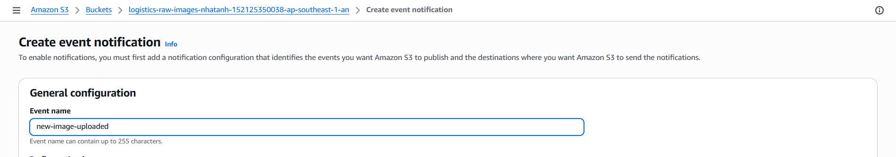

3. Ở phần **Event types**, tích chọn **s3:ObjectCreated:***.

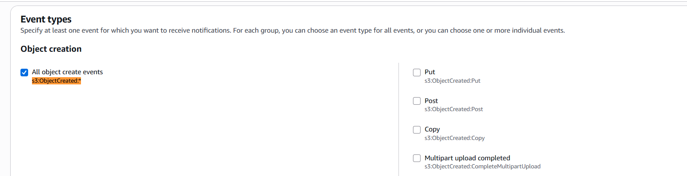

4. Ở phần **Prefix/Suffix**, nhập các suffix ảnh như **.jpg**, **.jpeg**, **.png** để chỉ kích hoạt khi có ảnh tải lên.

Cấu hình này giúp bỏ qua các file không phải ảnh như `.txt` hoặc `.pdf`.

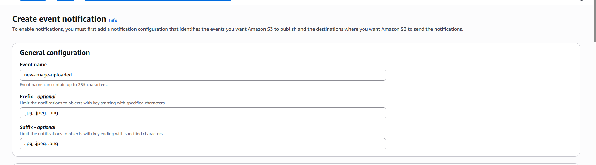

5. Ở phần **Destination**, chọn **SQS Queue**, sau đó chọn queue **image-processing-queue**.

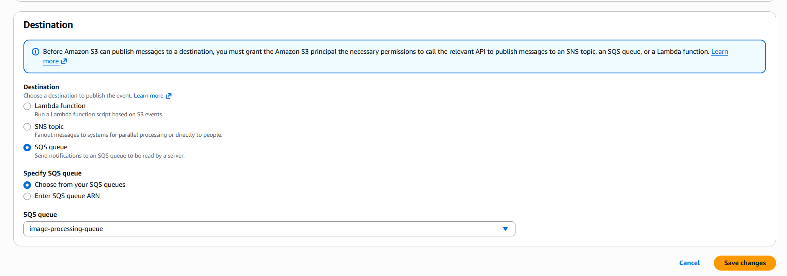

6. Chọn **Save changes** để lưu cấu hình.

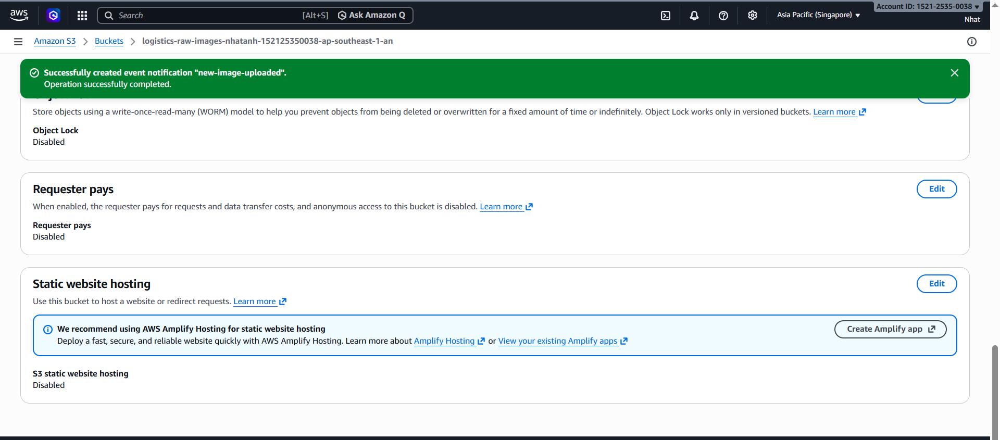

---

## Bước 4: Tạo và viết code cho AWS Lambda

### Mục tiêu

Trong bước này, bạn sẽ tạo Lambda Function để nhận message từ Amazon SQS, đọc thông tin ảnh được upload lên Amazon S3 và gọi các dịch vụ AI như Amazon Rekognition và Amazon Textract để phân tích ảnh.

---

### 4.1 - Tạo Lambda Function

1. Truy cập **AWS Lambda**, chọn **Create function**.

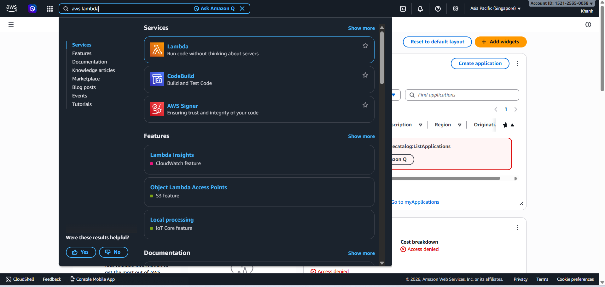

2. Chọn **Author from scratch**.

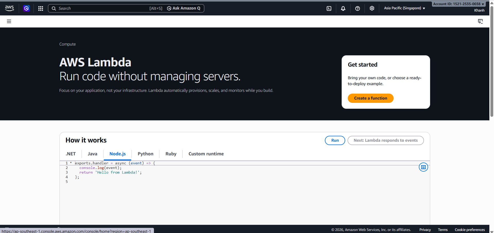

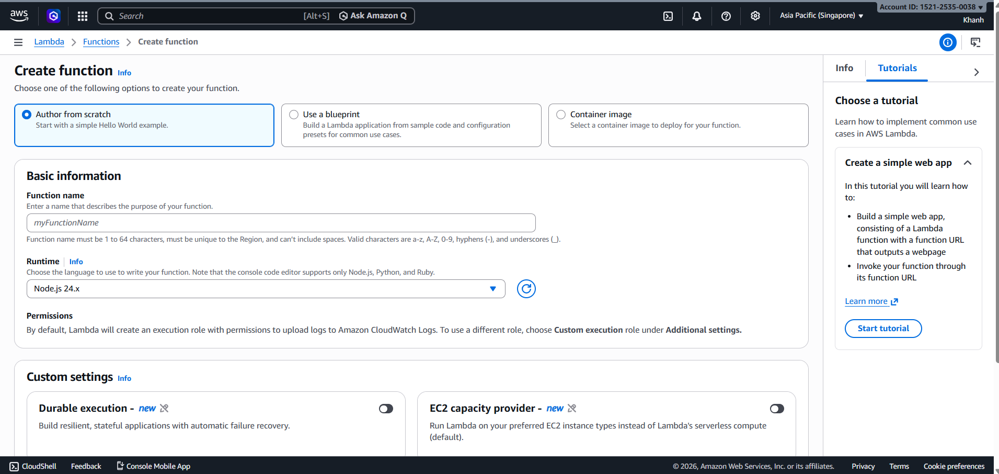

3. Cấu hình Lambda Function.

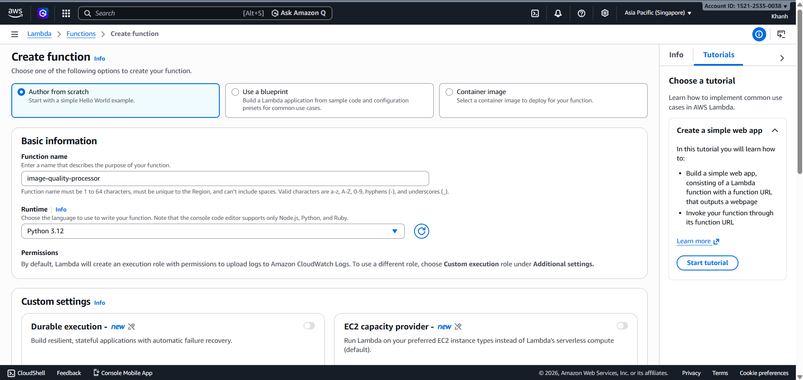

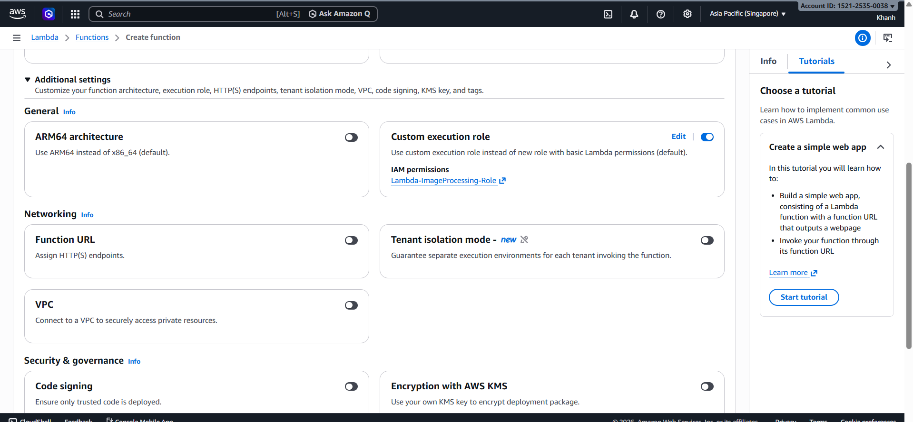

Gợi ý cấu hình:

- Function name: **image-quality-processor**
- Runtime: **Python 3.x**
- Execution role: chọn IAM Role **Lambda-ImageProcessing-Role** đã tạo ở bước 1

4. Chọn **Create function**.

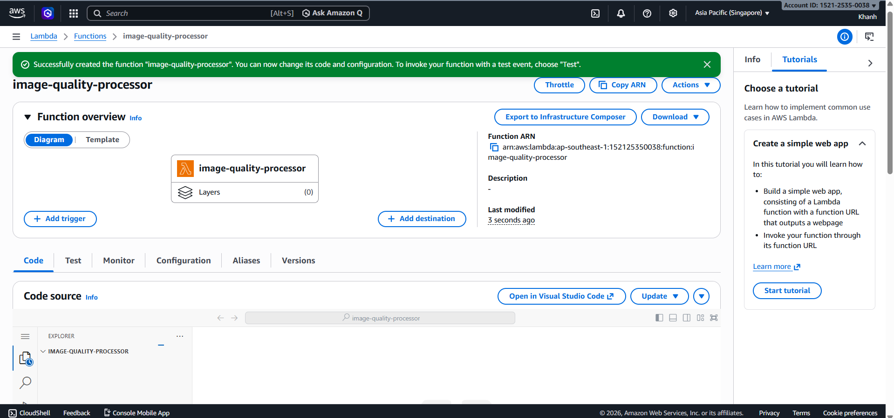

5. Vào tab **Configuration**, chọn **General configuration**, sau đó chọn **Edit**.

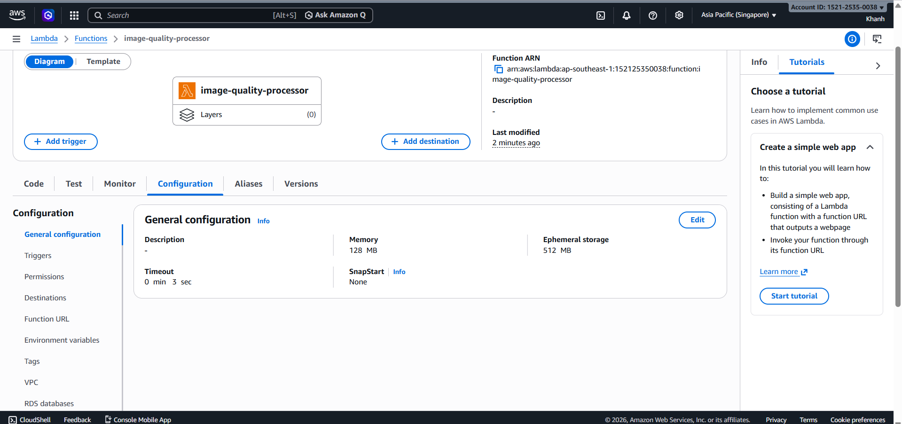

6. Đặt **Timeout = 60 giây**, sau đó lưu cấu hình.

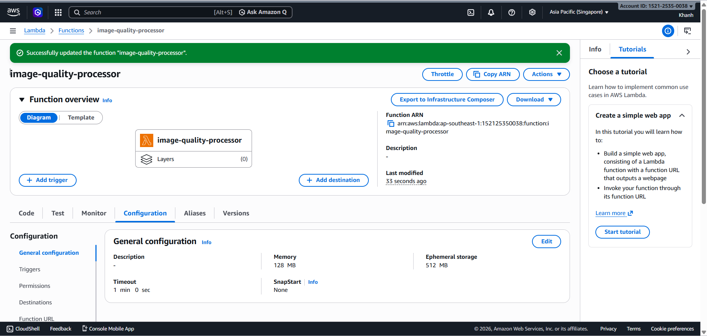

---

### 4.2 - Gắn SQS làm Trigger

1. Ở trang Lambda Function, chọn **Add trigger**.

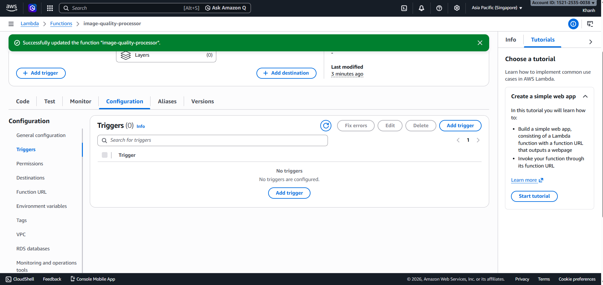

2. Chọn source là **SQS**.

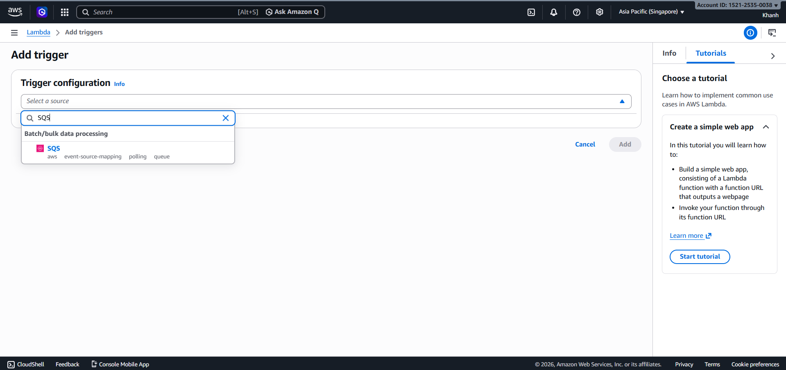

3. Chọn queue **image-processing-queue**.

4. Cấu hình **Batch size = 1**.

Batch size bằng 1 giúp Lambda xử lý từng message một, phù hợp cho lab vì dễ quan sát log và debug.

5. Chọn **Add**.

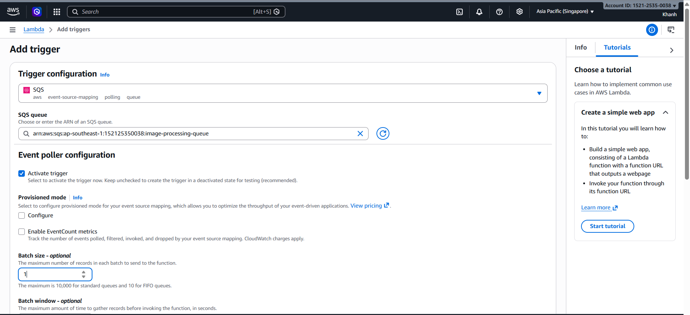

---

### 4.3 - Viết code Python

1. Vào tab **Code**.

2. Xóa code mẫu, dán đoạn code Python xử lý SQS message, sau đó chọn **Deploy** để lưu code.

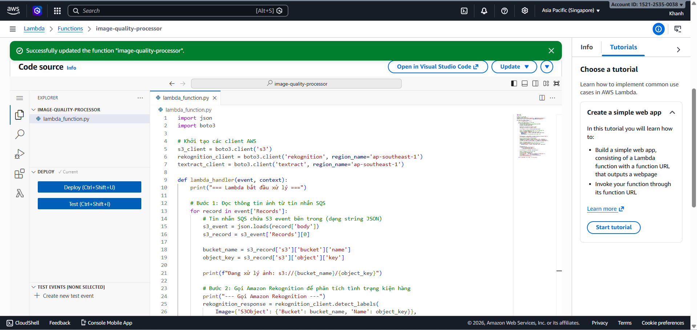

Code mẫu:

```python
import json
import urllib.parse

import boto3

s3 = boto3.client("s3")
rekognition = boto3.client("rekognition")
textract = boto3.client("textract")


def lambda_handler(event, context):
    for record in event["Records"]:
        body = json.loads(record["body"])

        for s3_record in body.get("Records", []):
            bucket = s3_record["s3"]["bucket"]["name"]
            key = urllib.parse.unquote_plus(s3_record["s3"]["object"]["key"])

            print(f"Processing image: s3://{bucket}/{key}")

            labels = rekognition.detect_labels(
                Image={
                    "S3Object": {
                        "Bucket": bucket,
                        "Name": key
                    }
                },
                MaxLabels=10,
                MinConfidence=70
            )

            print("Rekognition labels:")
            for label in labels["Labels"]:
                print(f"- {label['Name']}: {label['Confidence']:.2f}%")

            text_result = textract.detect_document_text(
                Document={
                    "S3Object": {
                        "Bucket": bucket,
                        "Name": key
                    }
                }
            )

            print("Textract text:")
            for block in text_result["Blocks"]:
                if block["BlockType"] == "LINE":
                    print(block["Text"])

    return {
        "statusCode": 200,
        "body": "Processed SQS messages successfully"
    }
```

---

## Bước 5: Kiểm thử hệ thống

### Mục tiêu

Xác nhận toàn bộ luồng **S3 -> SQS -> Lambda -> AI** hoạt động đúng.

Trong bước này, bạn sẽ upload ảnh lên S3, kiểm tra Lambda xử lý message từ SQS và xem kết quả phân tích trong CloudWatch Logs.

---

### 5.1 - Chuẩn bị ảnh test

Chuẩn bị ít nhất 2 loại ảnh:

- Ảnh kiện hàng bị móp hoặc rách để kiểm tra Amazon Rekognition phát hiện đúng nội dung ảnh.
- Ảnh có nhãn dán với mã vận đơn rõ ràng để kiểm tra Amazon Textract trích xuất đúng văn bản.

---

### 5.2 - Tải ảnh lên S3

1. Vào S3 bucket **logistics-raw-images-&lt;tên-bạn&gt;**, sau đó chọn **Upload**.

2. Tải lên khoảng **5-10 ảnh** cùng lúc để kiểm tra khả năng xử lý song song.

3. Chọn **Upload** để bắt đầu tải ảnh.

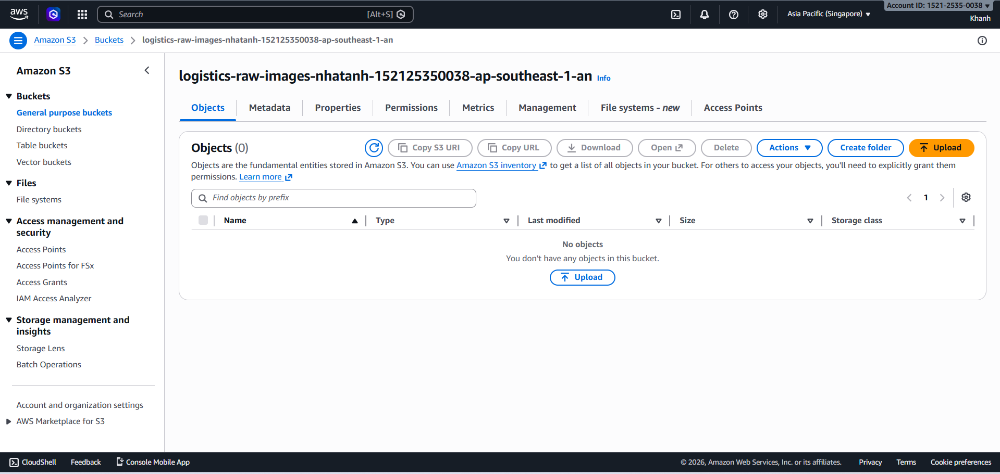

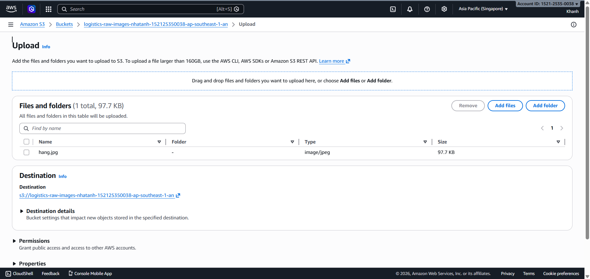

---

### 5.3 - Kiểm tra CloudWatch Logs

1. Truy cập **CloudWatch**, chọn **Log groups**.

2. Tìm log group **/aws/lambda/image-quality-processor**.

3. Chọn log stream mới nhất và kiểm tra output từ Lambda.

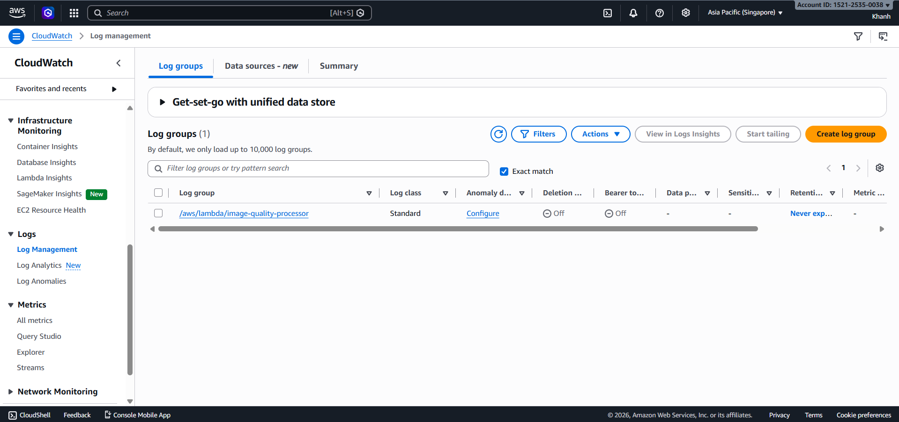

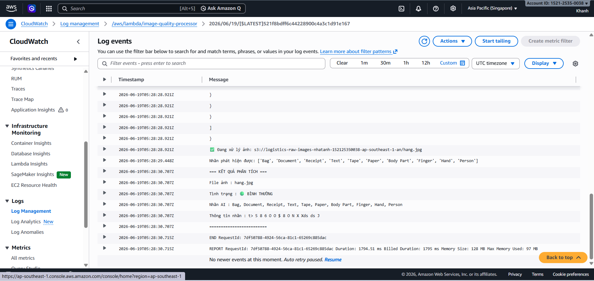

---

### 5.4 - Kiểm tra SQS đã xử lý sạch

1. Vào **SQS Console**, chọn queue **image-processing-queue**.

2. Chọn **Send and receive messages**.

3. Chọn **Poll for messages**.

Nếu queue trống, nghĩa là Lambda đã xử lý hết toàn bộ tin nhắn thành công.

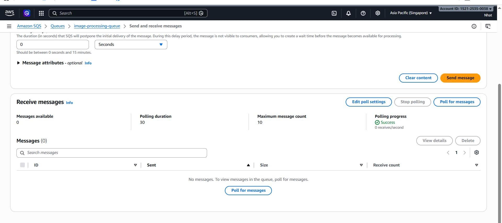

---

## Bước 6: Dọn dẹp tài nguyên

### Mục tiêu

Sau khi hoàn thành workshop, bạn cần xóa các tài nguyên đã tạo để tránh phát sinh chi phí không cần thiết.

---

### 1. Xóa SQS Queue

1. Truy cập **Amazon SQS**.

2. Chọn queue đã tạo trong workshop, sau đó chọn **Delete**.

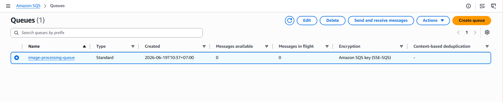

3. Nhập **Confirm** để xác nhận xóa queue.

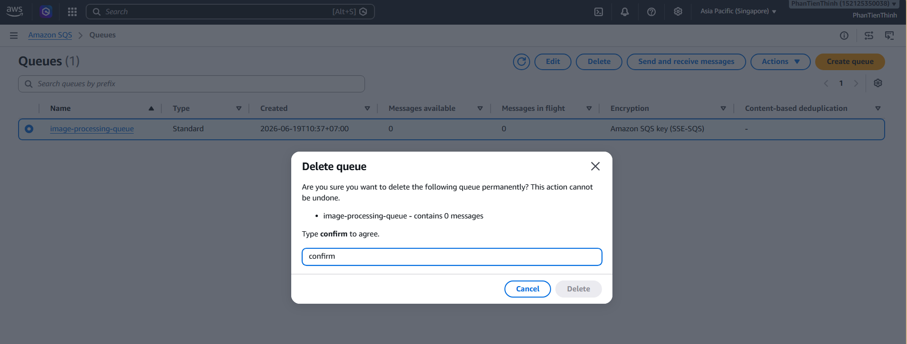

---

### 2. Xóa Lambda Function

1. Truy cập **AWS Lambda**.

2. Chọn function đã tạo trong workshop, sau đó chọn **Delete**.

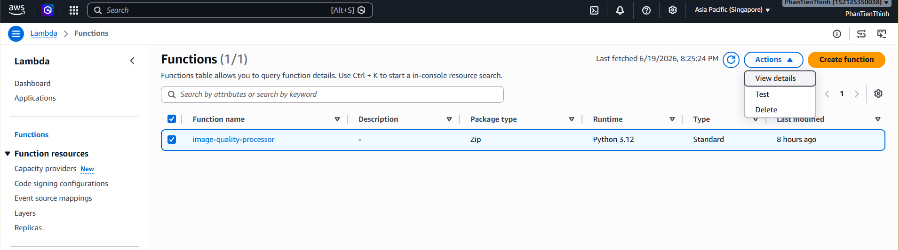

3. Nhập xác nhận để xóa function.

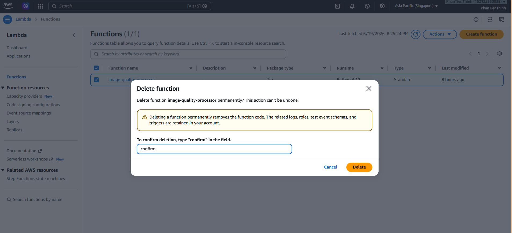

---

### 3. Xóa S3 Bucket

1. Truy cập **Amazon S3**.

2. Vào bucket đã tạo trong workshop.

3. Chọn bucket cần xóa, sau đó chọn **Delete**.

Lưu ý: S3 bucket cần được làm trống trước khi xóa. Nếu bucket còn object, hãy xóa toàn bộ object trong bucket trước.

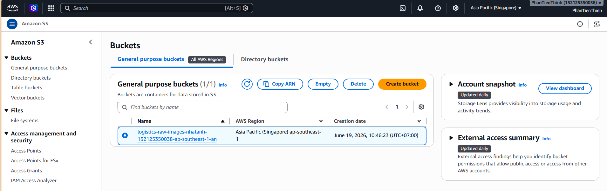

---

### 4. Xóa IAM Role

1. Truy cập **IAM**.

2. Chọn **Roles**.

3. Chọn IAM Role **Lambda-ImageProcessing-Role** đã tạo trong workshop, sau đó xóa role.

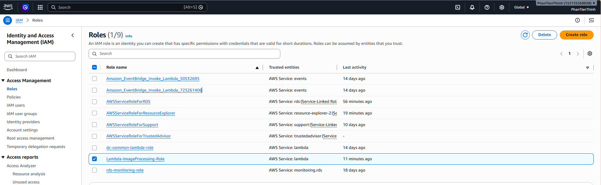

---

# PHẦN 6: TỰ ĐÁNH GIÁ

<div style="text-align: left;">

Trong suốt thời gian thực tập tại **First Cloud AI Journey (FCAJ)** từ ngày **04/05/2026 đến 24/07/2026**, tôi đã có cơ hội học hỏi, rèn luyện và áp dụng kiến thức được trang bị tại trường vào môi trường làm việc thực tế.

Tôi đã tham gia xây dựng hệ thống **Giải pháp tự động hóa giám sát chất lượng hàng hóa Logistics** sử dụng kiến trúc **AWS Serverless và AI/ML**, qua đó cải thiện kỹ năng **lập trình Python**, **thiết kế kiến trúc cloud**, sử dụng các dịch vụ AWS (**Lambda, S3, SQS, Rekognition, Textract, DynamoDB, Cognito, Amplify, API Gateway**) và kỹ năng **viết báo cáo kỹ thuật**.

### Bảng tự đánh giá

| STT | Tiêu chí | Mô tả | Tốt | Khá | TB |
|-----|---------|-------|-----|-----|-----|
| 1 | Kiến thức & kỹ năng chuyên môn | Hiểu biết về ngành, áp dụng kiến thức vào thực tế | | X | |
| 2 | Khả năng học hỏi | Tiếp thu kiến thức mới, học hỏi nhanh | | X | |
| 3 | Chủ động | Tự tìm hiểu, nhận nhiệm vụ mà không chờ chỉ dẫn | X | | |
| 4 | Tinh thần trách nhiệm | Hoàn thành công việc đúng hạn, đảm bảo chất lượng | X | | |
| 5 | Kỷ luật | Tuân thủ giờ giấc, nội quy, quy trình làm việc | | X | |
| 6 | Tính cầu tiến | Sẵn sàng nhận feedback và cải thiện bản thân | X |  | |
| 7 | Giao tiếp | Trình bày ý tưởng, báo cáo công việc rõ ràng | | X | |
| 8 | Hợp tác nhóm | Làm việc hiệu quả với đồng nghiệp | X | | |
| 9 | Ứng xử chuyên nghiệp | Tôn trọng đồng nghiệp, môi trường làm việc | X | | |
| 10 | Tư duy giải quyết vấn đề | Nhận diện vấn đề, đề xuất giải pháp | | X | |
| 11 | Đóng góp vào dự án | Hiệu quả công việc, sáng kiến cải tiến | X | | |
| 12 | Tổng thể | Đánh giá chung về toàn bộ quá trình thực tập | X | | |

### Cần cải thiện

- Nâng cao tính kỷ luật, chấp hành nghiêm chỉnh nội quy của công ty.
- Cải thiện tư duy giải quyết vấn đề, đặc biệt khi gặp lỗi hệ thống phức tạp.
- Học cách giao tiếp tốt hơn trong công việc và xử lý tình huống linh hoạt hơn.

</div>

---

# PHẦN 7: CHIA SẺ, ĐÓNG GÓP Ý KIẾN

<div style="text-align: left;">

### 1. Đánh giá chung

- **Môi trường làm việc:** Môi trường làm việc rất thân thiện và cởi mở. Các thành viên trong FCAJ luôn sẵn sàng hỗ trợ khi mình gặp khó khăn, kể cả ngoài giờ làm việc. Không gian làm việc gọn gàng, thoải mái, giúp mình tập trung tốt hơn.

- **Sự hỗ trợ của mentor / team admin:** Mentor hướng dẫn rất chi tiết, giải thích rõ ràng khi mình chưa hiểu và luôn khuyến khích mình đặt câu hỏi. Mình đánh giá cao việc mentor cho phép mình thử và tự xử lý vấn đề thay vì chỉ đưa đáp án.

- **Sự phù hợp giữa công việc và chuyên ngành học:** Công việc mình được giao phù hợp với kiến thức Công nghệ phần mềm đã học ở trường, đồng thời mở rộng thêm những mảng mới như thiết kế kiến trúc cloud, AI/ML và DevOps trên AWS.

- **Cơ hội học hỏi & phát triển kỹ năng:** Trong quá trình thực tập, mình học được nhiều kỹ năng mới: thiết kế hệ thống Serverless, sử dụng AI/ML của AWS, viết blog kỹ thuật và tham gia workshop thực hành. Mentor chia sẻ nhiều kinh nghiệm thực tế giúp mình định hướng tốt hơn.

- **Văn hóa & tinh thần đồng đội:** Văn hóa FCAJ rất tích cực: mọi người tôn trọng lẫn nhau, làm việc nghiêm túc nhưng vẫn vui vẻ. Điều này giúp mình cảm thấy mình là một phần của tập thể, dù chỉ là thực tập sinh.

### 2. Một số câu hỏi khác

- **Điều bạn hài lòng nhất trong thời gian thực tập?**
  Sự hỗ trợ nhiệt tình từ mentor và cơ hội thực chiến trên các dịch vụ AWS hiện đại.

- **Điều bạn nghĩ công ty cần cải thiện cho các thực tập sinh sau?**
  Cung cấp thêm tài liệu hướng dẫn chuyên sâu ban đầu để thực tập sinh nhanh chóng làm quen hệ thống.

- **Nếu giới thiệu cho bạn bè, bạn có khuyên họ thực tập ở đây không? Vì sao?**
  Chắc chắn có, vì đây là môi trường lý tưởng để rèn luyện kỹ năng thực tế về AWS và AI/ML.

### 3. Đề xuất & mong muốn

- **Bạn có đề xuất gì để cải thiện trải nghiệm trong kỳ thực tập?**
  Tổ chức thêm các buổi Tech Talk chia sẻ kinh nghiệm từ các kỹ sư senior.

- **Bạn có muốn tiếp tục chương trình này trong tương lai?**
  Rất mong muốn có cơ hội tiếp tục đồng hành cùng FCAJ.

- **Góp ý khác (tự do chia sẻ):**
  Cảm ơn team FCAJ đã mang lại một kỳ thực tập ý nghĩa và bổ ích.

</div>
